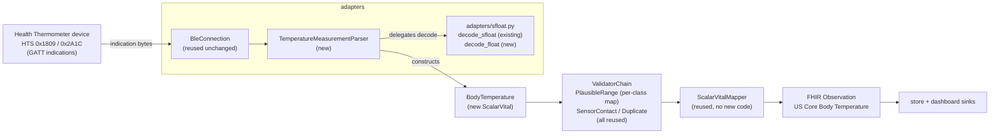

# Design Document

**Spec: body-temperature** (health thermometer — third phase-2 slice)

## Overview

This design implements body-temperature acquisition end to end by **reusing** the machinery the
blood-pressure and oxygen-saturation slices put in place. Body temperature is a single scalar
quantity (degrees Celsius), so — exactly like `HeartRate` and `OxygenSaturation`, and unlike
`BloodPressure`, which introduced the first `ComponentVital` — it lands as a new `ScalarVital`
(`BodyTemperature`). Being a `ScalarVital` means the existing `ScalarVitalMapper` produces its
Observation with **no new mapper code**, resolved through the existing MRO registry.

The genuinely new logic in this slice is narrow: a Temperature Measurement parser for the Health
Thermometer Service characteristic `0x2A1C`, and — its hardest new part — an IEEE-11073 **32-bit
FLOAT** decoder that lives alongside the existing 16-bit `decode_sfloat` in the shared
`adapters/sfloat.py` module. Everything else (the BLE lifecycle, the FHIR mapper, the duplicate and
sensor-contact validators, the per-class plausible-range validator) is reused unchanged.

Grounded in the current code (read during design): `vitals/base.py`, `vitals/builtin/heart_rate.py`,
`vitals/builtin/oxygen_saturation.py`, `vitals/__init__.py`, `adapters/ble.py` (the reusable
`BleConnection`), `adapters/sfloat.py`, `adapters/bp_parser.py`, `adapters/plx_parser.py`,
`adapters/builtin/{mock,pulse_oximeter_ble}.py`, `fhir/mappers.py`, `fhir/__init__.py`,
`validation/builtin/validators.py`, `pipeline/orchestrator.py`, `config.py`, and `cli.py`.
Traceability: each section cites the FR-TEMP-\*/NFR-TEMP-\* it satisfies, and a full mapping is given
at the end. The existing heart-rate, blood-pressure, and oxygen-saturation suites (plus the
dependency-direction test) are the regression guardrail through the one shared-module change (adding
`decode_float` to `adapters/sfloat.py`).

### What is reused unchanged (the payoff of BP and SpO2 going first)

- **`BleConnection`** (`adapters/ble.py`) — the profile-agnostic scan/connect/subscribe/reconnect
  lifecycle. The thermometer adapter composes it with HTS UUIDs, exactly as `BloodPressureBleAdapter`
  and `PulseOximeterBleAdapter` do. **No change to `BleConnection`** — including for indications; see
  design §5, which investigates this explicitly because it is the single most important technical risk
  in this slice.
- **`ScalarVitalMapper`** (`fhir/mappers.py`) — builds an Observation from a `ScalarVital`'s class
  metadata (`loinc_code`, `ucum_unit`, `us_core_profile`). `BodyTemperature` resolves to it via the
  existing MRO registry in `fhir/__init__.py`. **No new mapper code.** (The mapper already uses the
  vital's own `ucum_unit` as both the `valueQuantity.code` and `unit` display, so temperature reads
  `Cel` for both with no per-class display change — the display caveat the SpO2 slice resolved does
  not recur here.)
- **`DuplicateValidator`** — its scalar identity key `(device_id, effective, value)` already covers
  `BodyTemperature`. **No change.**
- **`SensorContactValidator`** — reads `getattr(vital, "sensor_contact", None)`, so it passes
  body temperature (which has no such field) through unchanged. **No change.**
- **`PlausibleRangeValidator`** — already generalized by the SpO2 slice to a per-vital-class
  `overrides` map. Body temperature is wired by adding a `BodyTemperature` entry to that map in the
  composition root; **no validator code change** (design §7).

### What is new or changed

| Area | Change | Requirement |
|------|--------|-------------|
| `vitals/builtin/body_temperature.py` | new `BodyTemperature(ScalarVital)` | FR-TEMP-1 |
| `vitals/__init__.py` | export `BodyTemperature` under `# Concrete defaults` | FR-TEMP-1 |
| `adapters/sfloat.py` | **new** `decode_float` (IEEE-11073 32-bit FLOAT), additive to `decode_sfloat` | FR-TEMP-2 |
| `adapters/temp_parser.py` | new `TemperatureMeasurementParser` for `0x2A1C` | FR-TEMP-3 |
| `adapters/temp_parser.py` | reuse the BP host-local `decode_timestamp` (see §4 recommendation) | FR-TEMP-3 |
| `adapters/builtin/thermometer_ble.py` | new `HealthThermometerBleAdapter` (composes `BleConnection`) | FR-TEMP-4 |
| `adapters/builtin/mock.py` | new `MockThermometerAdapter` + `ThermometerEmissionMode` | FR-TEMP-8 |
| `config.py` + `.env.example` | `VOF_TEMP_MIN` / `VOF_TEMP_MAX` | FR-TEMP-6 |
| `cli.py` | short names `temp` / `mock-temp`; wire temperature bounds into the overrides map | FR-TEMP-8, FR-TEMP-6 |
| `fhir/builders.py` | CapabilityStatement note (search unchanged) | FR-TEMP-7 |
| `docs/protocol-body-temperature-measurement.md` | Bluetooth SIG + IEEE-11073 citation | FR-TEMP-3, NFR-TEMP-4 |
| `docs/device-compatibility.md` | add a thermometer compatibility row | FR-TEMP-8 |
| `docs/brief-config-file.md` | config-surface checkpoint + structural-driver note | FR-TEMP-9 |
| `docs/brief-validation-modes.md` | **new** idea-only brief: plausibility vs personal/clinical relevance (flag-not-drop) | FR-TEMP-6 (context) |

Dependency directions are unchanged; every new module lives in the package that already owns its
concern (`BodyTemperature` in `vitals`, the decoder and parser and adapter in `adapters`), so
`test_dependency_directions.py` stays green (NFR-TEMP-2).

---

## Architecture

The data path is identical in shape to the SpO2 and BP slices; only the concrete adapter, parser, and
vital type differ:



`bleak` is imported lazily inside `BleConnection` only; the new adapter, parser, decoder, and mock
never import it at module level (FR-TEMP-4, NFR-TEMP-4). The orchestrator (`pipeline/orchestrator.py`)
already resolves the mapper per reading via `resolve_mapper(type(vital))`, so `BodyTemperature →
ScalarVitalMapper` dispatches with no orchestrator change (FR-TEMP-5).

---

## Components and Interfaces

### 1. `BodyTemperature` — `vitals/builtin/body_temperature.py` (FR-TEMP-1)

A frozen `ScalarVital`, structurally identical to `OxygenSaturation` but for temperature. No new
instance fields (the optional device temperature-type field is not modelled — see requirements Out of
scope; length-accounted only, design §4):

```python
@dataclass(frozen=True, kw_only=True)
class BodyTemperature(ScalarVital):
    loinc_code: ClassVar[str] = "8310-5"          # Body temperature
    ucum_unit: ClassVar[str] = "Cel"              # UCUM degrees Celsius
    us_core_profile: ClassVar[str] = (
        "http://hl7.org/fhir/us/core/StructureDefinition/us-core-body-temperature"
    )
    plausible_range: ClassVar[tuple[float, float]] = (10.0, 47.0)
```

Exported from `vitals/__init__.py` under `# Concrete defaults`. The existing `ScalarVital`
`__init_subclass__` enforcement fires because `loinc_code` is assigned, so a concrete subclass missing
any of the four required class variables raises at import time (FR-TEMP-1). No FHIR code in this
package; the LOINC/UCUM bindings are class metadata only, so a future non-FHIR target mapper can
consume `BodyTemperature` without touching `vitals` (NFR-TEMP-3).

**Range rationale.** Default `(10.0, 47.0)` °C. These are **physical-plausibility bounds, not
clinical thresholds.** Their only job is to reject values that could not have come from a live human
body — decode errors, sensor malfunction, an ambient/wrong-sensor reading — and *not* to judge whether
a reading is clinically normal, high, or low. Deciding whether a real reading is fever, hypothermia,
or normal is out of scope for a plausibility validator (and, per the product scope, out of scope for
this project as a whole — it is not a clinical-reference tool); dropping a genuine abnormal reading
would violate the project's faithful-representation mission, so the bounds are deliberately kept wide
enough to admit every temperature a human body has been documented to reach and still survive.

The bounds are grounded in the documented human survival envelope, with a small margin on each side:

- **Lower bound `10.0` °C** sits just below the lowest core temperature from which a person has been
  resuscitated neurologically intact after accidental hypothermia — about `11.8` °C in a young child
  ([PubMed 33084865](https://pubmed.ncbi.nlm.nih.gov/33084865/)); the lowest documented adult
  neurologically-intact case is `13.7` °C (the Anna Bågenholm case,
  [PubMed 32482520](https://pubmed.ncbi.nlm.nih.gov/32482520/)). Setting the floor a little under the
  lowest survivable value means a real cold reading is never discarded, while clearly non-physiological
  values (e.g. a `0` °C decode artifact or a room-temperature sensor read) still fall outside.
- **Upper bound `47.0` °C** sits just above the highest core temperature recorded in a heat-stroke
  survivor — `46.5` °C, a case from 1980 ([Guinness World Records — highest body
  temperature](https://www.guinnessworldrecords.com/world-records/67749-highest-body-temperature);
  [Wikipedia — Hyperthermia](https://en.wikipedia.org/wiki/Hyperthermia);
  [Ann Emerg Med, PubMed 7073052](https://pubmed.ncbi.nlm.nih.gov/7073052/)). The ceiling admits that
  documented extreme while rejecting values above the survivable envelope as artifacts.

These same citations are recorded in the new `docs/protocol-body-temperature-measurement.md`
range-rationale note (design §Docs deliverables). The bounds are overridable via `VOF_TEMP_MIN` /
`VOF_TEMP_MAX` (FR-TEMP-6). Because normalization to Celsius happens in the parser (design §4), the
validator always compares against Celsius bounds regardless of the device's reporting unit.

*(Sources rephrased for licensing compliance; inline URLs given above.)*

**LOINC choice.** `8310-5` ("Body temperature") is the code the US Core Body Temperature profile is
built around, and the profile expects a scalar `valueQuantity` in `Cel`. This is why body temperature
is a `ScalarVital`, not a `ComponentVital` — recorded so it is not re-litigated.

### 2. Shared IEEE-11073 32-bit FLOAT decoding — `adapters/sfloat.py` (FR-TEMP-2)

The Temperature Measurement value is an IEEE-11073 **32-bit FLOAT**, distinct from the 16-bit SFLOAT
that BP and SpO2 use. The two share the module but are separate functions with their own reserved
special-value sets. `decode_float` is added **additively** next to `decode_sfloat`; the existing
function and its behavior are untouched (FR-TEMP-2, NFR-TEMP-1).

**Bit layout (little-endian 4 bytes).** A 32-bit FLOAT packs an **8-bit signed exponent** in the high
byte and a **24-bit signed mantissa** in the low three bytes:

```
bits 31..24  →  exponent  (8-bit two's-complement signed)
bits 23..0   →  mantissa  (24-bit two's-complement signed)
value = mantissa × 10^exponent
```

This is the additive analogue of the SFLOAT's 4-bit exponent / 12-bit mantissa split; the decode
algorithm is the same shape (mask the mantissa, shift out the exponent, reject reserved mantissas,
sign-extend both fields, combine as `mantissa × 10^exponent`) with 32-bit-wide constants.

**FLOAT-specific reserved mantissa values.** The 24-bit mantissa has its own reserved special values,
scaled up from the SFLOAT set (which used the 12-bit values `0x07FF, 0x0800, 0x07FE, 0x0802, 0x0801`).
For the 24-bit FLOAT mantissa they are:

| Meaning | 24-bit mantissa |
|---------|-----------------|
| NaN (not a number) | `0x007FFFFF` |
| NRes (not at this resolution) | `0x00800000` |
| +INFINITY | `0x007FFFFE` |
| −INFINITY | `0x00800002` |
| Reserved for future use | `0x00800001` |

Any of these means the value does not represent a usable number, so `decode_float` returns `None` and
the caller (the parser) drops the reading — exactly the SFLOAT contract, using the FLOAT reserved set
rather than the SFLOAT one.

**Sign extension.** After masking, the 24-bit mantissa is sign-extended (subtract `0x1000000` when the
top mantissa bit `0x800000` is set) and the 8-bit exponent is sign-extended (subtract `0x100` when
`0x80` is set), so negative exponents and negative mantissas decode correctly. Sketch:

```python
FLOAT_SIZE = 4  # bytes
_FLOAT_RESERVED_MANTISSAS = frozenset(
    {0x007FFFFF, 0x00800000, 0x007FFFFE, 0x00800002, 0x00800001}
)

def decode_float(data: bytes, offset: int) -> float | None:
    """Decode a 32-bit IEEE-11073 FLOAT at *offset* (little-endian).

    8-bit signed exponent + 24-bit signed mantissa. Returns None for the FLOAT
    reserved mantissa values (NaN, NRes, ±INFINITY, reserved), which do not
    represent a usable number. Distinct from decode_sfloat's 16-bit form.
    """
    raw = int.from_bytes(data[offset : offset + FLOAT_SIZE], byteorder="little", signed=False)
    mantissa = raw & 0x00FFFFFF
    exponent = raw >> 24
    if mantissa in _FLOAT_RESERVED_MANTISSAS:
        return None
    if mantissa >= 0x800000:      # sign-extend 24-bit mantissa
        mantissa -= 0x1000000
    if exponent >= 0x80:          # sign-extend 8-bit exponent
        exponent -= 0x100
    return float(mantissa) * (10.0**exponent)
```

- **Placement:** `adapters/sfloat.py`. Both SFLOAT callers and the new FLOAT caller live in the
  `adapters` package, so this depends only on the standard library and adds no cross-package import
  (FR-TEMP-2, NFR-TEMP-2). The FLOAT encoding then exists once and is available to any future
  32-bit-FLOAT parser (e.g. weight, glucose), mirroring how `decode_sfloat` is shared today.
- **Additive guarantee:** `decode_sfloat`, its signature, its reserved set, and `SFLOAT_SIZE` are
  unchanged. The existing SFLOAT/BP/SpO2 tests are the guardrail: if any change, the extension is
  wrong (FR-TEMP-2, NFR-TEMP-1, NFR-TEMP-6).
- **Provenance:** the module header already cites IEEE-11073-20601, which defines *both* the SFLOAT and
  the FLOAT representations and both reserved-value sets; the new protocol doc references it (design
  §11, NFR-TEMP-4).

This is the one shared-code decision in the slice. Alternative considered — duplicating a FLOAT
decoder into the temperature parser — rejected for the same reason the SpO2 slice rejected duplicating
SFLOAT: two copies of fiddly bit-twiddling drift, and DRY here has no downside because both callers are
in the same package and the logic is pure.

### 3. `TemperatureMeasurementParser` — `adapters/temp_parser.py` (FR-TEMP-3)

Decodes GATT `0x2A1C` (Temperature Measurement). Byte-level logic lives in pure functions the class
delegates to, mirroring `parser.py`, `bp_parser.py`, and `plx_parser.py`.

**Payload layout (Temperature Measurement).** Flags byte (offset 0), then the mandatory temperature
**32-bit FLOAT** (offsets 1–4), then optional fields gated by the flags:

- **bit 0 — unit**: `0` → Celsius, `1` → Fahrenheit.
- **bit 1 — timestamp present**: a 7-byte org.bluetooth date-time follows the temperature FLOAT.
- **bit 2 — temperature type present**: a 1-byte temperature-type field follows (after the timestamp,
  if present). Not modelled; length-accounted only.

Pure functions:

```python
def parse_temp_flags(byte: int) -> TempFlags        # decode bits 0..2
def required_length(flags: TempFlags) -> int        # 1 + FLOAT(4) + optional timestamp(7) + type(1)
def fahrenheit_to_celsius(value: float) -> float     # (value - 32) * 5 / 9
```

**Fahrenheit → Celsius normalization (exact formula).** When flags bit 0 is set (Fahrenheit), the
decoded FLOAT value is normalized with `celsius = (fahrenheit - 32) * 5 / 9` before the Reading is
constructed; when bit 0 is clear (Celsius) the value is used unchanged. This is the temperature
counterpart to the blood-pressure kPa→mmHg normalization and guarantees `BodyTemperature.value` is
always Celsius (so the `Cel` UCUM code and the `VOF_TEMP_*` bounds are always correct — FR-TEMP-3,
FR-TEMP-5, FR-TEMP-6).

**Optional timestamp — reuse the BP host-local convention.** When flags bit 1 is set, the parser
decodes the 7-byte org.bluetooth date-time and uses it as the Reading's `effective` time, interpreting
the zoneless value as host local time and returning it timezone-aware — the exact convention the
blood-pressure slice defined. When bit 1 is clear, `effective = now()` (timezone-aware). The clock is
injectable for tests (FR-TEMP-3).

> **Recommendation — share `decode_timestamp`, do not duplicate it.** The BP slice already implements
> exactly this host-local, tz-aware, validity-checking decode in `bp_parser.decode_timestamp` (7-byte
> layout: `year` uint16-LE, then `month, day, hour, minute, second` uint8; returns `None` on an
> invalid/zero calendar date). The temperature parser needs identical behavior. Two options:
>
> 1. **Duplicate** the function into `temp_parser.py`.
> 2. **Extract** `decode_timestamp` (and the 7-byte `_TIMESTAMP_SIZE` constant) into the shared
>    `adapters/sfloat.py`-style location — the natural home is a small shared helper in the `adapters`
>    package (e.g. keep it in `bp_parser.py` and import it, or lift it into a shared
>    `adapters/datetime_field.py` and have `bp_parser` re-export it for back-compat, mirroring how
>    `decode_sfloat` was lifted into `adapters/sfloat.py` and re-exported from `bp_parser`).
>
> **The design recommends option 2 (extraction), matching the precedent the SpO2 slice set for
> SFLOAT.** Rationale against the steering rules: the no-duplication / maintainability rule (NFR-TEMP-1,
> tech "no duplication", structure "one name per concept") disfavors a second copy of a fiddly
> calendar-decode; and the dependency-direction rules are satisfied either way because both parsers are
> in the `adapters` package (`temp_parser` importing from `bp_parser` or from a new `adapters` helper is
> an intra-package import, which the AST dependency test permits). The cleanest form is a new
> `adapters/datetime_field.py` holding `decode_timestamp` + `TIMESTAMP_SIZE`, with `bp_parser.py`
> importing and re-exporting `decode_timestamp` so its existing `__all__` and tests stay green
> (behavior-preserving, additive — NFR-TEMP-1). `temp_parser.py` imports the same helper. This keeps the
> org.bluetooth date-time decode defined once, exactly as the SFLOAT decode is. If the team prefers to
> avoid touching `bp_parser.py` at all, option 1 (duplicate) is acceptable but is called out here as the
> less-clean choice; confirm during review.

**Temperature-type length accounting.** When flags bit 2 is set, `required_length` adds the 1-byte
temperature-type field so a short payload is rejected, but the field is not decoded into the Reading
(requirements Out of scope; may be added later additively without changing this parser's output).

`TemperatureMeasurementParser(GattCharacteristicParser)` sketch:

```python
def __init__(self, device_id: str, now: Callable[[], datetime] | None = None) -> None:
    self._device_id = device_id
    self._now = now if now is not None else (lambda: datetime.now().astimezone())  # tz-aware local

def parse(self, data: bytes) -> VitalSign | None:
    if len(data) < 1:
        return None
    flags = parse_temp_flags(data[0])
    if len(data) < required_length(flags):
        return None
    temp = decode_float(data, _TEMPERATURE_OFFSET)      # shared FLOAT decoder; offset 1
    if temp is None:                                     # reserved/unusable → drop
        return None
    if flags.unit_is_fahrenheit:
        temp = fahrenheit_to_celsius(temp)
    if flags.timestamp_present:
        effective = decode_timestamp(data, _TIMESTAMP_OFFSET)   # offset 5 (1 + FLOAT_SIZE)
        if effective is None:                                    # invalid calendar date → drop
            return None
    else:
        effective = self._now()
    return BodyTemperature(effective=effective, device_id=self._device_id, value=temp)
```

- Malformed/short/reserved-FLOAT/invalid-timestamp → `None`; the adapter drops it, logging at `DEBUG`
  with byte length only, never the value (FR-TEMP-3, NFR-TEMP-5).
- Byte-level decoding is pure functions the class delegates to, using the shared `decode_float`
  (FR-TEMP-3).
- `docs/protocol-body-temperature-measurement.md` cites the HTS / Temperature Measurement spec and
  IEEE-11073 32-bit FLOAT (FR-TEMP-3, NFR-TEMP-4).

### 4. `HealthThermometerBleAdapter` — `adapters/builtin/thermometer_ble.py` (FR-TEMP-4)

A near-exact analogue of `PulseOximeterBleAdapter`: subclasses `DeviceAdapter` directly, composes a
`BleConnection` configured for the HTS profile, and delegates the lifecycle:

```python
HEALTH_THERMOMETER_SERVICE_UUID = "00001809-0000-1000-8000-00805f9b34fb"      # 0x1809
TEMPERATURE_MEASUREMENT_UUID    = "00002a1c-0000-1000-8000-00805f9b34fb"      # 0x2A1C

class HealthThermometerBleAdapter(DeviceAdapter):
    supported_vitals = (BodyTemperature,)
    def __init__(self, *, device_name=None, on_state_change=None, now=None):
        self._now = now
        self._connection = BleConnection(
            service_uuid=HEALTH_THERMOMETER_SERVICE_UUID,
            characteristic_uuid=TEMPERATURE_MEASUREMENT_UUID,
            matches=self.matches,
            parser_factory=self._build_parser,
            device_name=device_name,
            on_state_change=on_state_change,
        )
    def matches(self, advertisement) -> bool: return True     # service-UUID scan is authoritative
    @property
    def device_info(self) -> DeviceInfo:
        return DeviceInfo(manufacturer="Generic", model="Health Thermometer",
                          identifiers={"profile": "org.bluetooth.service.health_thermometer"})
    # state/connect/disconnect/vitals delegate to self._connection
    def _build_parser(self):
        from vitals_on_fhir.adapters.temp_parser import TemperatureMeasurementParser
        return TemperatureMeasurementParser(
            device_id=self.device_info.identifiers["profile"], now=self._now)
```

`bleak` stays lazily imported inside `BleConnection` only (FR-TEMP-4, NFR-TEMP-4). The parser import
inside `_build_parser` is lazy to avoid an import cycle (`temp_parser` imports `adapters.ble`),
matching the BP and SpO2 adapters. Composition (not inheritance) keeps the adapter within the
object-model 3-level cap (FR-TEMP-4).

### 5. Indications vs notifications — the key technical risk (FR-TEMP-4)

**This is the single most important technical question in the slice, so it is investigated
explicitly.** The HTS Temperature Measurement characteristic `0x2A1C` is delivered by the device via
GATT **indications** (acknowledged), whereas the Heart Rate, Blood Pressure, and PLX Continuous
characteristics this project already handles use **notifications** (unacknowledged). The natural worry
is that reusing `BleConnection` "unchanged" is unsafe if it only knows how to subscribe to
notifications.

**Finding (from reading `adapters/ble.py`):** `BleConnection` subscribes with a single call —
`await client.start_notify(self._characteristic_uuid, _notification_callback)` — and unsubscribes with
`await client.stop_notify(self._characteristic_uuid)`. In `bleak`, `start_notify` inspects the
characteristic's declared properties/CCCD and **transparently enables notifications *or* indications**
as appropriate for that characteristic, delivering both through the *same* callback signature
`(characteristic, data: bytearray)`. `stop_notify` likewise tears down whichever was enabled. So for an
indication-only characteristic like `0x2A1C`, bleak enables indications automatically; `BleConnection`
needs no branch, no flag, and no new method.

**Consequence:** the "reuse `BleConnection` unchanged" assumption **holds** for this slice. Targeting
`0x2A1C` requires only passing its service/characteristic UUIDs into the existing constructor — exactly
as the BP and SpO2 adapters pass theirs. No shared-lifecycle behavior is changed, so no other adapter
is affected and no `**Breaking:**` changelog note is needed (NFR-TEMP-1). This is the same mechanism
the SpO2 design already documented when it noted that bleak's `start_notify` covers both delivery modes
(SpO2 deferred the indication-based spot-check `0x2A5E` for *timestamp* reasons, not delivery-mode
reasons).

**Residual risk and how it is bounded.** The only place this could bite is a real device whose stack
requires an explicit indication subscription that bleak does not infer — a hardware-specific edge case,
not a design flaw in `BleConnection`. That risk lives entirely behind the `hardware` marker (a real
thermometer), is excluded from CI, and would be surfaced by a hardware test, not by the fast suite.
The fast-suite adapter tests drive `BleConnection` behavior through the queue/callback path directly
(delivery mode is irrelevant to them). **If** a future hardware finding shows an explicit
indication call is needed, that would be a minimal *additive* accommodation to `BleConnection` (e.g. an
optional "use indications" hint) introduced deliberately with its own changelog note — **not** a silent
change to shared behavior. This design does not make that change, because the evidence says it is not
required.

### 6. `MockThermometerAdapter` — `adapters/builtin/mock.py` (FR-TEMP-8)

Add a parallel `MockThermometerAdapter` + `ThermometerEmissionMode`, mirroring `MockAdapter`,
`MockBloodPressureAdapter`, and `MockOximeterAdapter`, emitting `BodyTemperature`, never importing
`bleak`:

```python
class ThermometerEmissionMode(enum.Enum):
    VALID = "valid"                    # e.g. 37.0 °C, inside the plausible range
    IMPLAUSIBLE = "implausible"        # outside the plausible range (e.g. 60.0 °C)
    FAHRENHEIT_SOURCE = "fahrenheit"   # a valid reading whose Celsius value corresponds to a
                                       # normalized Fahrenheit source (e.g. 98.6 °F → 37.0 °C),
                                       # exercising the normalization path end to end
```

Notes:
- The mock emits **domain objects** (`BodyTemperature`, always Celsius), so the `FAHRENHEIT_SOURCE`
  mode emits a `BodyTemperature` whose `value` is the *already-normalized* Celsius equivalent (37.0),
  documenting the normalization contract at the adapter boundary. The byte-level Fahrenheit→Celsius
  conversion itself is exercised by the parser tests against raw payloads (design §10), which is where
  the FLOAT-decode-plus-normalize logic actually lives.
- There is no store-and-forward mode here (that is a BP concern); the optional timestamp path is
  covered by the parser tests, not the mock.
- `MockThermometerAdapter` mirrors the other mocks' `connect`/`disconnect`/`state`/`vitals`/`count`
  shape exactly. Exported from `adapters/__init__.py` under `# Concrete defaults`.

### 7. Validation wiring + per-vital-class plausibility (FR-TEMP-6)

No validator code changes. The `PlausibleRangeValidator` is already a per-vital-class `overrides`-map
validator (generalized by the SpO2 slice). Body temperature is wired by adding one entry to the map the
composition root builds (design §9):

```python
scalar_overrides = {
    HeartRate:        (settings.hr_min,   settings.hr_max),
    OxygenSaturation: (settings.spo2_min, settings.spo2_max),
    BodyTemperature:  (settings.temp_min, settings.temp_max),   # new
}
```

Lookup is per reading: `overrides[type(vital)]` if present, else the class's `plausible_range`. So
`VOF_TEMP_*` bounds apply **only** to `BodyTemperature` readings and never cross-apply to heart rate or
SpO2, and vice versa (FR-TEMP-6). `DuplicateValidator` (scalar identity key covers temperature) and
`SensorContactValidator` (passes non-HR vitals through) are unchanged. Rejections log at `INFO` with
the bounds only, never the value (FR-TEMP-6, NFR-TEMP-5).

### 8. FHIR mapping — reused, no code (FR-TEMP-5)

`BodyTemperature` is a `ScalarVital`, and `fhir/__init__.py` already registers `ScalarVitalMapper` for
`ScalarVital`. `resolve_mapper(BodyTemperature)` walks the MRO and returns `ScalarVitalMapper`, which
builds the Observation from `BodyTemperature`'s class metadata: panel `code` `8310-5`, `valueQuantity`
with UCUM `code` `Cel` and `value` the Celsius temperature, `meta.profile` the US Core Body Temperature
URL, `status` `final`, category `vital-signs`. No registration, no mapper subclass, no change to
`fhir/`. `HeartRate → ScalarVitalMapper`, `OxygenSaturation → ScalarVitalMapper`, and `BloodPressure →
ComponentVitalMapper` resolution are unchanged (FR-TEMP-5). Construction goes through
`Observation.model_validate`, so model validation runs at build time; a validation failure propagates
to the orchestrator boundary, which logs at `ERROR` (no value) and does not store/serve (FR-TEMP-5,
NFR-TEMP-3).

### 9. Configuration — `config.py` + `.env.example` (FR-TEMP-6)

```python
# Validation bounds — body temperature (Cel); physical-plausibility, not clinical (design §1)
temp_min: float = 10.0
temp_max: float = 47.0
```

`env_prefix="VOF_"` maps these to `VOF_TEMP_MIN` / `VOF_TEMP_MAX`; `extra="forbid"` still rejects
unknown vars. Both added to `.env.example` with comments. Config is loaded once in `cli.py` and passed
explicitly; no module-level global, no mutation after startup (tech steering). Surface after this
slice: the `VOF_*` count grows by two (checkpoint update in `docs/brief-config-file.md`, design §11).

### 10. CLI wiring — `cli.py` (FR-TEMP-8, FR-TEMP-6)

- `_resolve_adapter`: add `"temp"` → `HealthThermometerBleAdapter(device_name=settings.device_name)`
  and `"mock-temp"` → `MockThermometerAdapter()`, alongside the existing `mock`, `mock-bp`,
  `mock-spo2`, `miband10`, `bp`, `spo2` names. Update the `--adapter` help text and the
  `ValueError`/`argparse` strings to list the new names.
- `_build_orchestrator`: add the `BodyTemperature` entry to `scalar_overrides` (design §7). Validator
  order is unchanged; each validator no-ops for vitals it does not handle.
- Any third-party thermometer adapter remains selectable by fully qualified
  `package.module.ClassName` with no repository change (FR-TEMP-8).
- No orchestrator change: `orchestrator.run()` resolves the mapper per vital via `resolve_mapper`, so
  `BodyTemperature → ScalarVitalMapper` dispatches automatically (FR-TEMP-5).

### 11. API and CapabilityStatement — `fhir/builders.py` (FR-TEMP-7)

Body-temperature Observations are searchable through the existing read-only endpoints with no new
endpoint and no write operation. `GET /fhir/Observation?code=8310-5` filters temperature Observations
by their LOINC code using the existing `code` search parameter. The `GET /fhir/metadata`
CapabilityStatement is updated only to reflect that body-temperature Observations are among the
searchable vital-signs (a descriptive note; the endpoint set and search parameters are unchanged)
(FR-TEMP-7).

---

## Data Models

`BodyTemperature` (frozen, kw_only): `effective: datetime` (tz-aware, inherited), `device_id: str`
(inherited), `value: float` (inherited from `ScalarVital`, the temperature in Celsius). Class metadata:
`loinc_code` `8310-5`, `ucum_unit` `Cel`, `us_core_profile` US Core Body Temperature, `plausible_range`
`(10.0, 47.0)` (physical-plausibility bounds, not clinical thresholds — design §1).

Produced FHIR `Observation` (US Core Body Temperature) — shape:

```jsonc
{
  "resourceType": "Observation",
  "id": "<uuid4>",
  "meta": {"profile": ["http://hl7.org/fhir/us/core/StructureDefinition/us-core-body-temperature"]},
  "status": "final",
  "category": [{"coding": [{"system": ".../observation-category", "code": "vital-signs",
                            "display": "Vital Signs"}]}],
  "code": {"coding": [{"system": "http://loinc.org", "code": "8310-5"}]},
  "subject": {"reference": "Patient/local-patient"},
  "device":  {"reference": "Device/<slug>"},
  "effectiveDateTime": "2026-10-05T12:00:00+00:00",
  "issued":            "2026-10-05T12:00:00+00:00",
  "valueQuantity": {"value": 37.0, "unit": "Cel", "system": "http://unitsofmeasure.org", "code": "Cel"}
}
```

`effectiveDateTime` is the device timestamp (host-local, tz-aware) when the payload carried one, else
the processing time; `issued` is always the processing time. Both are serialized in UTC by the mapper.

---

## Correctness Properties

*A property is a characteristic or behavior that should hold true across all valid executions of a
system — essentially, a formal statement about what the system should do. Properties serve as the
bridge between human-readable specifications and machine-verifiable correctness guarantees.*

This slice adds two things that are strongly property-suitable: a pure numeric decoder (32-bit FLOAT)
and a binary payload parser. Parsers and value codecs are the canonical PBT targets — round-trip and
robustness properties catch the sign-extension, offset, and length bugs that concrete examples miss.
The properties below come directly from the prework analysis (with redundant candidates folded in).

### Property 1: FLOAT decode round-trip

*For any* integer mantissa in the representable signed 24-bit range and any signed 8-bit exponent, when
those fields are packed little-endian into a 4-byte word (avoiding the FLOAT reserved mantissa values),
`decode_float` returns a value equal (within floating-point tolerance) to `mantissa × 10^exponent`,
with the correct sign for negative mantissas and negative exponents.

**Validates: Requirements FR-TEMP-2.a**

### Property 2: Parser never crashes on arbitrary bytes

*For any* byte string, `TemperatureMeasurementParser.parse` returns either a `BodyTemperature` instance
or `None`, and never raises. (This is the robustness guard: short payloads, reserved FLOATs, invalid
timestamps, and every flag combination are all reachable by arbitrary bytes and must all resolve to a
drop rather than an exception.)

**Validates: Requirements FR-TEMP-3.a, FR-TEMP-3.d, FR-TEMP-3.e**

### Property 3: Well-formed payload build → parse round-trip

*For any* generated Celsius temperature value and any combination of the optional-field flags
(timestamp present/absent, temperature-type present/absent), a Temperature Measurement payload built to
encode that value parses back to a `BodyTemperature` whose `value` equals the source temperature
(within tolerance); and when the timestamp flag is set to a generated valid calendar date-time, the
parsed `effective` time equals that date-time interpreted as host-local and returned timezone-aware.

**Validates: Requirements FR-TEMP-3.a, FR-TEMP-3.c, FR-TEMP-3.d**

### Property 4: Fahrenheit normalization correctness

*For any* generated temperature value, a Fahrenheit-flagged payload encoding `C × 9/5 + 32` and a
Celsius-flagged payload encoding `C` parse to `BodyTemperature.value` results that are equal within
tolerance (both `≈ C`); equivalently, the parser applies `(F − 32) × 5/9` exactly when and only when
the unit flag is set, so the constructed Reading is always in Celsius.

**Validates: Requirements FR-TEMP-3.b**

### Property 5: Per-class bounds applied with no cross-application

*For any* per-vital-class overrides map and *any* scalar reading, the bounds the
`PlausibleRangeValidator` applies are exactly that reading's own class bounds (its override entry when
present, else its class `plausible_range`); the reading is accepted iff its value lies within those
bounds. Consequently a value out of range for `BodyTemperature` is rejected as a `BodyTemperature` even
if it would be in range for `HeartRate` or `OxygenSaturation`, and a temperature override never changes
the accept/reject decision for a non-temperature reading.

**Validates: Requirements FR-TEMP-6.a, FR-TEMP-6.c**

---

## Error Handling

- **Malformed / unusable payload** (empty, too short for the declared fields, reserved/unusable
  FLOAT, or a declared timestamp that is not a valid calendar date-time): the parser returns `None`;
  the adapter drops it, logging at `DEBUG` with byte length only, never the value. (FR-TEMP-3,
  NFR-TEMP-5)
- **Out-of-range temperature**: `PlausibleRangeValidator` rejects; the orchestrator logs the rejection
  at `INFO` with the validator name and the bounds, but not the value. (FR-TEMP-6, NFR-TEMP-5)
- **Duplicate reading**: `DuplicateValidator` rejects on a repeated `(device_id, effective, value)`
  triple; logged at `INFO`, no value. (FR-TEMP-6)
- **Observation construction failure**: `Observation.model_validate` raises; the orchestrator boundary
  catches it, logs at `ERROR` (no value), and does not store or serve the Observation. (FR-TEMP-5,
  NFR-TEMP-3)
- **`bleak` unavailable**: `BleConnection` raises a clear `RuntimeError` via the existing lazy-import
  guard. The mock thermometer path needs no Bluetooth stack. (FR-TEMP-4)
- **Indication subscription** (hardware only): if a real device required an explicit indication
  subscription bleak did not infer, that surfaces only under the `hardware` marker (excluded from CI)
  and would be an additive `BleConnection` accommodation, not a silent shared-behavior change
  (design §5). The fast suite is unaffected. (FR-TEMP-4, NFR-TEMP-1)

---

## Testing Strategy

**Dual approach.** Unit/example tests cover specific behaviors, edge cases, and error conditions;
property-based tests cover the universal properties above across generated inputs. Both are necessary:
the parser and the FLOAT decoder warrant property tests; the wiring, config, mapper shape, and logging
discipline warrant example/integration tests.

**Property-based testing applies here** — this slice has a pure numeric codec and a binary parser, the
canonical PBT targets. Per the testing steering doc, use **Hypothesis** (already a project dependency);
do not hand-roll generators for the codec. Configure each property test for **≥ 100 iterations** and
tag it with a comment referencing the design property:

```
# Feature: body-temperature, Property 1: FLOAT decode round-trip
```

Each of the five correctness properties is implemented by a **single** property-based test. The fast
suite runs without hardware (NFR-TEMP-6).

New tests mirror the `tests/` structure:

- `tests/vitals/`: `BodyTemperature.__init_subclass__` metadata enforcement (a deliberately incomplete
  local subclass raises); instances are frozen; class metadata present and correct (`8310-5`, `Cel`,
  US Core Body Temperature, `(10.0, 47.0)`). *(EXAMPLE/EDGE_CASE — FR-TEMP-1.)*
- `tests/adapters/` — decoder: **Property 1** (FLOAT round-trip, Hypothesis, ≥100 iters); edge-case
  examples for each of the five FLOAT reserved mantissas → `None`; negative-exponent and
  negative-mantissa examples. Kept **separate** from the existing SFLOAT decoder tests; the SFLOAT
  tests are the additive-change guardrail. *(FR-TEMP-2, NFR-TEMP-6.)*
- `tests/adapters/` — parser: pure-function unit tests for `parse_temp_flags`, `required_length` (across
  optional-field combinations), and `fahrenheit_to_celsius`; **Property 2** (never crashes on arbitrary
  bytes); **Property 3** (valid-payload build→parse round-trip across flag combinations, including the
  timestamp-present branch and temperature-type-present length accounting); **Property 4** (Fahrenheit
  normalization). Edge-case examples: truncated payload, reserved-FLOAT payload, invalid-calendar-date
  timestamp payload, and short-with-type-present → all `None`; timestamp-absent branch uses a pinned
  injected clock. *(FR-TEMP-3, NFR-TEMP-6.)*
- `tests/adapters/` — mock + adapter: `MockThermometerAdapter` emission modes (VALID / IMPLAUSIBLE /
  FAHRENHEIT_SOURCE) and never-imports-`bleak`; `HealthThermometerBleAdapter` satisfies the reusable
  `DeviceAdapter` contract suite and the `BleConnection` behavior (state transitions, drop-`None`,
  disconnect unblocks `vitals()`, a quiet interval while connected is not a disconnection).
  *(FR-TEMP-4, FR-TEMP-8.)*
- `tests/fhir/`: `resolve_mapper(BodyTemperature) → ScalarVitalMapper`; the built Observation validates
  as US Core Body Temperature with `value`, UCUM `code` `Cel`, LOINC `8310-5`. Existing `HeartRate →
  ScalarVitalMapper`, `OxygenSaturation → ScalarVitalMapper`, and `BloodPressure →
  ComponentVitalMapper` resolution unchanged. *(FR-TEMP-5, NFR-TEMP-3.)*
- `tests/validation/`: **Property 5** (per-class bounds applied, no cross-application); back-compat
  `(hr_min, hr_max)` construction still behaves as before; rejection reason names bounds only, never
  the value; a `BodyTemperature` duplicate on the `(device_id, effective, value)` triple is rejected.
  *(FR-TEMP-6, NFR-TEMP-5.)*
- `tests/` config: `VOF_TEMP_MIN` / `VOF_TEMP_MAX` load and defaults; `extra="forbid"` still rejects
  unknown vars. *(FR-TEMP-6.)*
- `tests/api/`: search by `code=8310-5` returns temperature Observations; CapabilityStatement reflects
  searchability; no write operation. *(FR-TEMP-7.)*
- **Regression guardrail:** the full existing heart-rate, blood-pressure, and oxygen-saturation suites
  plus `tests/test_dependency_directions.py` stay green after `decode_float` is added to the shared
  module and (if the extraction option is taken) after `decode_timestamp` is lifted into a shared
  `adapters` helper with `bp_parser` re-exporting it. *(NFR-TEMP-1, NFR-TEMP-2, NFR-TEMP-6.)*
- Hardware tests for a real thermometer carry the `hardware` marker and are excluded from CI. This is
  where any real-device indication-subscription behavior would be verified (design §5). *(NFR-TEMP-6.)*

---

## Docs deliverables

- **`docs/protocol-body-temperature-measurement.md`** (new): cites the Bluetooth SIG Health Thermometer
  Service (`0x1809`) and Temperature Measurement characteristic (`0x2A1C`), the GATT Specification
  Supplement (flags byte, FLOAT value field, optional timestamp and temperature-type fields, offsets),
  Assigned Numbers (`0x1809` / `0x2A1C` UUIDs), and ISO/IEEE 11073-20601 (the 32-bit FLOAT encoding and
  its reserved values) — each with name, version, and URL or publication date, mirroring
  `docs/protocol-pulse-oximeter-measurement.md`. States the Fahrenheit→Celsius normalization, the
  host-local tz-aware timestamp convention (referencing the blood-pressure doc), and that no code was
  copied from other projects. Includes the Bluetooth SIG trademark notice. **Also carries a
  range-rationale note** (or a dedicated citations note) recording the evidence behind the
  `(10.0, 47.0)` °C physical-plausibility bounds: the lower bound sits below the lowest documented
  neurologically-intact accidental-hypothermia survival (~11.8 °C pediatric,
  [PubMed 33084865](https://pubmed.ncbi.nlm.nih.gov/33084865/); 13.7 °C adult / Anna Bågenholm,
  [PubMed 32482520](https://pubmed.ncbi.nlm.nih.gov/32482520/)); the upper bound sits just above the
  highest recorded heat-stroke survivor (46.5 °C, 1980 —
  [Guinness](https://www.guinnessworldrecords.com/world-records/67749-highest-body-temperature),
  [Wikipedia — Hyperthermia](https://en.wikipedia.org/wiki/Hyperthermia),
  [Ann Emerg Med, PubMed 7073052](https://pubmed.ncbi.nlm.nih.gov/7073052/)). The note states plainly
  that these are physical-plausibility bounds, not clinical thresholds, paraphrases the sources
  (no verbatim quoting), and includes the inline source URLs. *(FR-TEMP-3, NFR-TEMP-4, FR-TEMP-1.)*
- **`docs/device-compatibility.md`** (update): add a row — "BLE thermometers (standard Health
  Thermometer Service `0x1809`) → Supported via `HealthThermometerBleAdapter` (composes the shared
  `BleConnection` lifecycle); unverified against specific devices." *(FR-TEMP-8.)*
- **`docs/brief-validation-modes.md`** (new, authored as a task of this spec — *idea only, not
  scheduled*): a design brief recorded with the same "**Status:** Idea only. Not scheduled, not a
  decision." framing as `docs/brief-config-file.md`, and carrying the SPDX header as its first line
  (`<!-- SPDX-License-Identifier: AGPL-3.0-or-later -->`), matching that brief. This brief is written
  as part of this slice but builds no code and changes no behavior; it captures a distinction the
  temperature-bounds discussion surfaced. Its content must capture:
  - **The core distinction.** *Physical plausibility* is a device/physics-bound accept-or-reject
    decision — "could a live human body have produced this value at all?" — which is exactly what the
    current `PlausibleRangeValidator` does, and what this slice's wide `(10.0, 47.0)` °C bounds
    encode. *Personal/clinical relevance* is a person-bound judgment — "is this value normal, high, or
    low *for this person*?" — which only the user or their clinician can supply. The two are different
    kinds of check and must not be conflated.
  - **Decision (user-approved): flag, never drop.** Personal/clinical thresholds must **annotate/flag**
    a reading (e.g. set FHIR `interpretation` normal/high/low on the Observation), **never drop** it.
    Dropping a real abnormal reading would violate the project's faithful-representation mission — an
    abnormal-but-genuine temperature is precisely the reading a caregiver most needs to see. Only
    physical-plausibility violations (which are almost certainly artifacts) are dropped; everything a
    real body can produce is represented.
  - **Three options for deriving personal thresholds, with honest tradeoffs** (as the user proposed):
    1. **Predefined keyword modes** (e.g. a "full-range" mode vs a "conventional/clinical" mode
       selected by name). Tradeoff: needs curated, cited per-vital reference data, which sits in
       tension with the product's explicit "not a clinical-reference tool" scope.
    2. **±k·SD with a user-selectable k (default 2).** Tradeoff: needs either a population mean/SD or a
       per-person rolling baseline plus stored measurement history (which depends on phase-4
       persistence); and if used as a *validation* (drop) bound it would reject roughly 5% of genuine
       readings at k = 2 — so it is only defensible as a *flagging* heuristic, never as a drop rule.
    3. **Explicit per-person bounds** supplied directly by the user/clinician.
  - **Dependencies and guardrails.** This rides on structured configuration (the `config.yaml` idea in
    `docs/brief-config-file.md`); it likely needs stored per-person history (phase 4); it would be its
    own spec with its own requirements and a `CHANGELOG.md` entry. Regardless of which option is ever
    pursued, the physical-plausibility bounds stay wide and physics-based — personal thresholds layer
    *on top of* plausibility as a flagging concern, never replacing or narrowing the drop bounds.
  *(FR-TEMP-6 context; NFR-TEMP-4 for the SPDX header. Idea-only: builds no code, per Out of scope.)*
- **`docs/brief-config-file.md`** (update): two additions.
  - Add a "Checkpoint — after body temperature" subsection. After `VOF_TEMP_*` lands the counted
    `VOF_*` surface becomes **17** (the prior 15 plus `VOF_TEMP_MIN`/`VOF_TEMP_MAX`), of which **10**
    are per-vital plausibility-range keys. Record the recount and an explicit judgment of whether the
    flat env list has become "awkward" enough to promote the `config.yaml` idea to its own spec. The
    checkpoint only records the count and judgment; it does **not** build a config-file layer (per the
    brief's guardrails).
  - Add a short note recording a **second, *structural* driver** toward `config.yaml`, distinct from
    the existing flat-list-*length* driver: per-vital validation **modes** (from the new
    `docs/brief-validation-modes.md`) do not express cleanly as flat `VOF_<VITAL>_<BOUND>` pairs —
    keyword modes, k-factors, and per-person option sets are structured/nested by nature. This does
    **not** change the current "not yet awkward" judgment on length; it adds a structural consideration
    to revisit if per-vital modes are ever pursued. *(FR-TEMP-9.)*
- **`CHANGELOG.md`** (update, added in the final task, not deferred): entry for the body-temperature
  slice listing the new `BodyTemperature`, `decode_float`, `TemperatureMeasurementParser`,
  `HealthThermometerBleAdapter`, `MockThermometerAdapter`, `VOF_TEMP_*`, and the `temp` / `mock-temp`
  short names; noting the `decode_float` addition is additive (no `**Breaking:**`) and, if the timestamp
  extraction option is taken, that `decode_timestamp` moved to a shared `adapters` helper and is
  re-exported from `bp_parser` (non-breaking). *(changelog-rules steering.)*
- **`NOTICE`**: no third-party or EviTrace-ported material is introduced by this slice, so `NOTICE`
  needs no new entry; if any is added during implementation it must be recorded there. *(NFR-TEMP-4.)*

---

## Requirements traceability

| Design section | Requirements satisfied |
|----------------|------------------------|
| §1 `BodyTemperature` ScalarVital | FR-TEMP-1; NFR-TEMP-3 (metadata independent of FHIR) |
| §2 `decode_float` (32-bit FLOAT) | FR-TEMP-2; NFR-TEMP-1 (additive), NFR-TEMP-2 (placement/deps) |
| §3 `TemperatureMeasurementParser` | FR-TEMP-3; NFR-TEMP-4 (citation), NFR-TEMP-5 (no values logged) |
| §4 `HealthThermometerBleAdapter` | FR-TEMP-4; NFR-TEMP-1 (3-level cap), NFR-TEMP-4 (lazy bleak) |
| §5 Indications vs notifications | FR-TEMP-4; NFR-TEMP-1 (no silent shared-behavior change) |
| §6 `MockThermometerAdapter` | FR-TEMP-8; NFR-TEMP-5 (no bleak, no side channel) |
| §7 Validation wiring | FR-TEMP-6; NFR-TEMP-1 (no validator ABC change), NFR-TEMP-5 |
| §8 FHIR mapping (reused) | FR-TEMP-5; NFR-TEMP-3 (model validation) |
| §9 Configuration | FR-TEMP-6; FR-TEMP-9 (surface count) |
| §10 CLI wiring | FR-TEMP-8; FR-TEMP-6 |
| §11 API / CapabilityStatement | FR-TEMP-7; NFR-TEMP-5 (no write op) |
| Correctness Properties 1–5 | FR-TEMP-2 (P1), FR-TEMP-3 (P2, P3, P4), FR-TEMP-6 (P5) |
| Error Handling | FR-TEMP-3, FR-TEMP-5, FR-TEMP-6, FR-TEMP-4; NFR-TEMP-5 |
| Testing Strategy | NFR-TEMP-6; NFR-TEMP-1, NFR-TEMP-2 (regression guardrails) |
| Docs deliverables (incl. `brief-validation-modes.md`, `brief-config-file.md` note) | FR-TEMP-1, FR-TEMP-3, FR-TEMP-6, FR-TEMP-8, FR-TEMP-9; NFR-TEMP-4 |
| SPDX header on every new file | NFR-TEMP-4 |

---

## Resolved decisions

1. **Scalar, not component.** Body temperature is a single Celsius quantity → `ScalarVital`; the
   existing scalar mapper builds its Observation with no new code. (design §1, §8)
2. **Temperature Measurement characteristic only.** Target `0x2A1C`; the Intermediate Temperature
   characteristic `0x2A1E` (notification-based) is deferred to its own slice, mirroring how SpO2
   deferred the spot-check characteristic. (design §3, requirements Out of scope)
3. **Indications need no lifecycle change.** bleak's `start_notify`/`stop_notify` transparently handle
   indications as well as notifications, so `0x2A1C` reuses `BleConnection` unchanged; the reuse
   assumption holds and is the key risk investigated in design §5. (design §5)
4. **Shared 32-bit FLOAT decoder.** Add `decode_float` to `adapters/sfloat.py`, additive to
   `decode_sfloat`, with its own FLOAT reserved-value set. (design §2)
5. **Fahrenheit normalization in the parser.** `(F − 32) × 5/9` applied when the unit flag is set, so
   `BodyTemperature.value` is always Celsius. (design §3, Property 4)
6. **Timestamp decode — extract and share (recommended).** Lift `decode_timestamp` into a shared
   `adapters` helper and re-export it from `bp_parser` (behavior-preserving), so the org.bluetooth
   date-time decode is defined once — matching the SFLOAT precedent. Duplication is the acceptable but
   less-clean fallback. Confirm during review. (design §3)
7. **Per-class plausibility, no new validator code.** Add a `BodyTemperature` entry to the existing
   `PlausibleRangeValidator` overrides map in the composition root. (design §7, Property 5)
8. **Adapter short names.** `"temp"` (built-in BLE) and `"mock-temp"` (mock). (design §10)
9. **Config-surface checkpoint.** `VOF_TEMP_*` brings the counted surface to 17; record the recount and
   the "awkward?" judgment in `docs/brief-config-file.md` without building a config-file layer.
   (design §9, §Docs deliverables)
