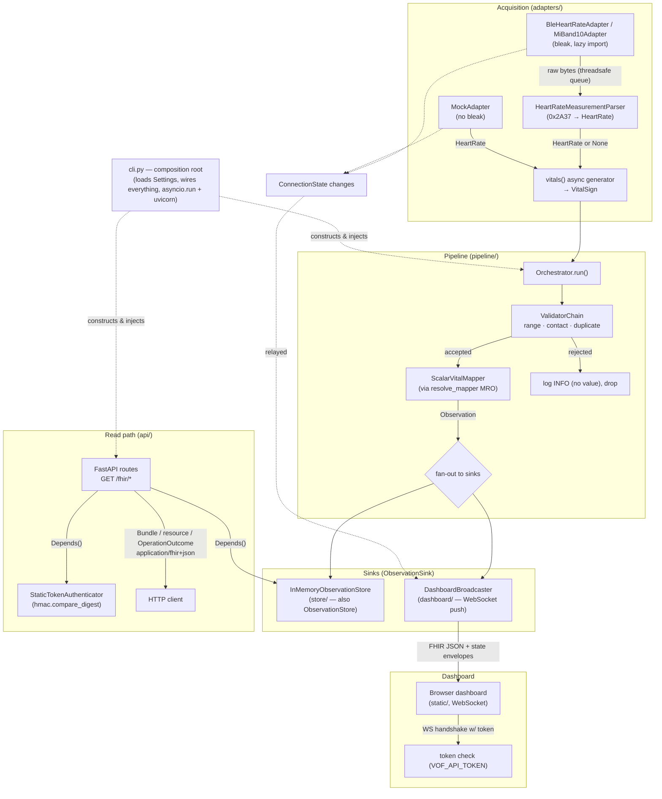

# Design Document

**Spec: hr-pipeline**

## Overview

This spec fills in the business logic behind the `repo-scaffold` stubs so the heart-rate MVP
works end to end: a live Bluetooth (or simulated) heart-rate stream becomes HL7 FHIR R4
Observations that are stored in memory, served over a read-only token-authenticated REST API, and
pushed to a live web dashboard over WebSocket.

The design does **not** introduce new structure. Every module, ABC, method signature, and
`__all__` export already exists in the scaffold (see `structure.md` and `object-model.md`). This
document describes *how* to implement each existing stub against its already-fixed interface, and
which requirement (FR-*/NFR-*) each implementation satisfies.

Guiding principles carried over from the steering docs, applied throughout:

- **ABC-driven.** Every extension point is an ABC; concrete classes live in `builtin/` subpackages.
  The `Orchestrator`, API routes, and sinks depend only on ABCs. Only `cli.py` names concrete
  classes. (`object-model.md`, FR-ORCH, FR-13.)
- **Async end-to-end.** The whole acquisition-to-sink path is `asyncio`. Shared store state is
  guarded by an `asyncio.Lock`. `asyncio.run()` appears only in `cli.py`. BLE notifications that
  arrive on a non-loop thread are handed back to the loop with `loop.call_soon_threadsafe`.
  (`tech.md`, FR-2, FR-STORE, FR-ORCH.)
- **FHIR is the only measurement representation.** Once a reading is accepted, it exists in the
  system only as a `fhir.resources` `Observation`. The store, API, and broadcaster carry no
  non-FHIR measurement side channel. (FR-8.)
- **`fhir.resources` used directly.** Models are constructed, never subclassed or wrapped;
  serialization is `model_dump_json()` and validation is construction-time / `model_validate()`.
  (`tech.md`, `fhir-conventions.md`.)
- **Security defaults are deliberate.** Constant-time token compare, 401 + `OperationOutcome`
  (issue code `security`, never 403), bind to `127.0.0.1` by default, no secrets or measurement
  values in logs above `DEBUG`. (`security-privacy.md`, FR-12, NFR-5.)
- **Composition root is `cli.py`.** Settings are loaded once and passed explicitly; there is no
  module-level global config or singleton. (`tech.md`, FR-ORCH.)

When this spec is complete, no `raise NotImplementedError` / `...` stubs remain in the packages
below, and `uv run pytest` (the fast, no-hardware suite) passes.

---

## Architecture

### End-to-end data flow



Two independent async concerns run in the same event loop, started from `cli.py`:

1. **Acquisition + fan-out** — `Orchestrator.run()` consumes `adapter.vitals()`, validates, maps,
   and publishes to sinks. (FR-1, FR-2, FR-3b, FR-4, FR-8, FR-10, FR-ORCH.)
2. **HTTP + WebSocket serving** — the uvicorn-hosted FastAPI app serves the read-only FHIR API and
   the dashboard WebSocket. (FR-11, FR-12, FR-5, FR-10.)

### Where authentication sits

- **HTTP:** a FastAPI dependency extracts the `Authorization: Bearer <token>` header and calls
  `Authenticator.authenticate`. Failure raises before any route body runs → 401 `OperationOutcome`.
  (FR-12.)
- **WebSocket:** the dashboard endpoint reads the token from the WebSocket handshake (query
  parameter per the decision in §10) and calls the same `Authenticator` before
  `websocket.accept()`. An unauthenticated socket is closed/refused, never registered with the
  broadcaster. (FR-12.)

### Dependency directions (unchanged)

The implementation must keep the `structure.md` dependency table intact — verified by
`tests/test_dependency_directions.py` (NFR-6). Notable constraints this design respects:

- `pipeline/orchestrator.py` imports `adapters`, `validation`, `fhir` — but never `store`, `api`,
  `dashboard`, or `cli`. Sinks reach it as `ObservationSink` ABCs injected by `cli.py`.
- `store/memory.py` and `dashboard/broadcaster.py` import `pipeline` (for `ObservationSink`) and
  `fhir` — never `adapters`, `validation`, `api`, or each other.
- `api/` imports `store`, `fhir`, `vitals` — never `adapters`, `validation`, `pipeline`,
  `dashboard`.
- `adapters/` imports `vitals` only; `bleak` is imported lazily inside method bodies of the BLE
  adapters, never at module level and never by `MockAdapter`.
- `cli.py` is the only module that imports concrete classes from every package.

---

## Components and Interfaces

Each subsection names the existing scaffold module and describes the concrete implementation plan.
Signatures shown are the ones already fixed in the scaffold; the plan fills in the bodies only.

### 1. `HeartRate` and its flow (`vitals/builtin/heart_rate.py`)

`HeartRate` is already complete (frozen dataclass, `ScalarVital`, LOINC `8867-4`, `/min`, US Core
profile, `plausible_range=(20.0, 250.0)`, optional `sensor_contact: bool | None`). No change.

It flows unchanged as a `VitalSign` from adapter → orchestrator → validators, and is read by the
mapper for its `value`, `effective`, `device_id`, and class metadata. This spec adds no vital-sign
logic beyond heart rate (out-of-scope guard preserved).

### 2. Parser (`adapters/parser.py`)

Implements `HeartRateMeasurementParser.parse(data: bytes) -> VitalSign | None` per the Bluetooth
Heart Rate Measurement (0x2A37) layout. **Byte-level decoding lives in module-level pure
functions**; the class delegates to them (FR-3a, `object-model.md`).

Flags byte (offset 0) bit layout used to compute offsets:

| Bit | Meaning | Effect on decode |
|-----|---------|------------------|
| 0 | HR value format | `0` → value is uint8 (1 byte); `1` → value is uint16 LE (2 bytes) |
| 1 | Sensor contact status | detected bit, only meaningful when bit 2 set |
| 2 | Sensor contact supported | `0` → `sensor_contact = None`; `1` → `sensor_contact = bool(bit 1)` |
| 3 | Energy expended present | if set, 2 bytes follow the HR value (skipped for HR decode) |
| 4 | RR-interval present | if set, remaining bytes are uint16 RR values (not needed for HR) |

Pure helper functions (all total, never raise on bad input — they validate length and return a
sentinel the class turns into `None`):

- `parse_flags(byte: int) -> HrFlags` — decode the five relevant bits into a small immutable record.
- `hr_value_size(flags) -> int` — `2` if uint16 else `1`.
- `required_length(flags) -> int` — `1 (flags) + hr_value_size + (2 if energy_expended else 0)`
  (RR intervals, if present, occupy the tail and are not required for HR decode, but the payload
  must still be long enough for the HR value and any energy-expended field).
- `decode_hr_value(data, flags) -> int` — read uint8 or uint16 LE at offset 1.
- `decode_sensor_contact(flags) -> bool | None` — per the table above.

`parse()` algorithm:

1. If `len(data) < 1`, return `None`.
2. `flags = parse_flags(data[0])`.
3. If `len(data) < required_length(flags)`, return `None` (too short for declared fields — FR-3a).
4. `value = decode_hr_value(data, flags)`; `sensor_contact = decode_sensor_contact(flags)`.
5. Construct and return `HeartRate(effective=<now, tz-aware UTC>, device_id=<adapter id>,
   value=float(value), sensor_contact=sensor_contact)`.

The parser does not itself hold the `device_id` or clock; the `BleHeartRateAdapter` supplies
`effective` (arrival time, timezone-aware) and `device_id` when it constructs the reading. To keep
`parse()` pure over bytes while still returning a `HeartRate`, the parser is constructed with a
`device_id` and a `now` callable (defaulting to `datetime.now(tz=UTC)`); this keeps the byte
decoding functions pure and testable and lets Hypothesis tests pin the clock. Malformed → `None`,
and the adapter drops it without yielding (FR-3a).

The Bluetooth SIG Heart Rate Service / Heart Rate Measurement specification (name, version, URL)
must be cited in `docs/` as part of this spec (FR-3a).

### 3. BLE adapters (`adapters/ble.py`, `adapters/builtin/miband10.py`)

`BleHeartRateAdapter` (ABC) gains a concrete base implementation of the connection lifecycle;
subclasses still only implement `matches()` and `device_info`. `bleak` is imported **lazily inside
method bodies**, guarded so a missing/unavailable stack raises a clear `RuntimeError` rather than a
bare `ImportError` (`tech.md`).

State and collaborators held on the instance:

- `_state: ConnectionState` (starts `DISCONNECTED`), exposed via the existing `state` property
  (FR-1). A private `_set_state()` updates it and notifies a state callback that the orchestrator
  wires to the broadcaster (FR-6; see Design Decisions — connection-state relay).
- `_queue: asyncio.Queue[bytes]` — the threadsafe hand-off buffer.
- `_parser: HeartRateMeasurementParser` — constructed with this adapter's `device_id`.
- `_client` — the `bleak.BleakClient` (created lazily).

Method plans:

- `connect()` (FR-1, FR-2): lazily import `bleak`; set `CONNECTING`; scan with `BleakScanner`,
  filtering candidates through `matches()` and the optional `VOF_DEVICE_NAME` name filter; connect
  to the first match; subscribe to `0x2A37` with a notification callback; set `CONNECTED`. Exactly
  one device per session (FR-1).
- notification callback (FR-2): runs on bleak's thread. It does **no async work** — it calls
  `loop.call_soon_threadsafe(self._queue.put_nowait, bytes(data))` to hand the payload to the loop.
- `vitals()` (FR-2): async generator. While not disconnected, `await self._queue.get()`, pass the
  bytes to `self._parser.parse(...)`; if `None`, log at `DEBUG` and continue (drop); otherwise
  `yield` the `HeartRate`. Yields indefinitely until disconnect (FR-2).
- reconnection loop (NFR-2): on a bleak disconnect callback or a failed read, set `RECONNECTING`,
  and retry `connect()` with capped exponential backoff until it succeeds (→ `CONNECTED`, resume)
  or `disconnect()` is called. The `vitals()` generator stays alive across reconnects so downstream
  resumes automatically (FR-6).
- `disconnect()` (FR-1): stop notifications, disconnect the client, set `DISCONNECTED`, and unblock
  `vitals()` (e.g. via a sentinel on the queue or a cancellation flag).

`MiBand10Adapter` implements `matches(advertisement)` by the Xiaomi Smart Band 10 advertised name
/ HRS service UUID, and `device_info` returning `DeviceInfo(manufacturer="Xiaomi",
model="Smart Band 10", identifiers={"bluetooth_address": <addr>})`. `supported_vitals = (HeartRate,)`.

All BLE code paths are exercised only under the `hardware` pytest marker (NFR-6, `testing.md`).

### 4. Mock adapter (`adapters/builtin/mock.py`)

`MockAdapter` implements `DeviceAdapter` fully **without importing `bleak`** (FR-9). It is the
default test double and the default `--adapter` value.

- Construction: an `emission_mode` enum/param — `VALID`, `IMPLAUSIBLE`, `NO_SENSOR_CONTACT` — plus
  an optional interval and count. Modes let tests drive each `ValidatorChain` branch (FR-9,
  `testing.md`).
- `supported_vitals = (HeartRate,)`; `device_info` returns a synthetic
  `DeviceInfo(manufacturer="vitals-on-fhir", model="Mock HR", identifiers={"mock": "1"})`.
- `state`: transitions `CONNECTING` → `CONNECTED` on `connect()`, `DISCONNECTED` on `disconnect()`,
  consistent with the `DeviceAdapter` contract (FR-9).
- `vitals()`: async generator yielding `HeartRate` per mode with a **timezone-aware** `effective`
  (`datetime.now(tz=UTC)`) (FR-9). `VALID` yields in-range values; `IMPLAUSIBLE` yields values
  outside the range; `NO_SENSOR_CONTACT` yields `sensor_contact=False`. A small `asyncio.sleep`
  between yields keeps it cooperative.

### 5. Validation (`validation/base.py`, `validation/builtin/validators.py`)

`ValidatorChain` and all three validators are already implemented in the scaffold and satisfy
FR-3b as written (registration-order, first-rejection, non-scalar pass-through, `VOF_HR_MIN/MAX`
override, `sensor_contact is False` rejection with `None` accepted, `(device_id, effective, value)`
duplicate set). This spec **uses** them; it changes them only if a test reveals a gap. The
orchestrator constructs the chain from config in the order
`[PlausibleRangeValidator(hr_min, hr_max), SensorContactValidator(), DuplicateValidator()]`
(assembled in `cli.py`, FR-3b, FR-ORCH). Rejections are logged at `INFO` **without the value**
(FR-3b, NFR-5).

### 6. FHIR mapping (`fhir/mappers.py`, `fhir/builders.py`, `fhir/__init__.py`)

`ScalarVitalMapper.to_observation(vital, patient_ref, device_ref, issued)` builds an `Observation`
entirely from `ScalarVital` class metadata (FR-4, `fhir-conventions.md`):

- `id = str(uuid.uuid4())` (FR-4, UUID v4 per `fhir-conventions.md`).
- `meta.profile = [type(vital).us_core_profile]`.
- `status = "final"`; `category` = the vital-signs coding; `code` = LOINC coding from
  `type(vital).loinc_code` with system `http://loinc.org`.
- `subject.reference = patient_ref`; `device.reference = device_ref`.
- `effectiveDateTime` = `vital.effective` converted to UTC ISO 8601; `issued` = `issued` (UTC).
  Both set (FR-4).
- `valueQuantity` = `{value: vital.value, unit: "beats/minute", system:
  "http://unitsofmeasure.org", code: type(vital).ucum_unit}`.
- Constructed with `fhir.resources` model classes so validation runs at construction (FR-4, NFR-4).
  Import `fhir.resources` at runtime inside the method body (module keeps the `TYPE_CHECKING`
  guard). On `ValidationError`, the mapper lets it propagate; the orchestrator catches it, logs at
  `ERROR`, and does not store/serve (FR-4).

`ComponentVitalMapper` stays a roadmap stub (no MVP vital uses it).

**Mapper registry** (`fhir/__init__.py`): register `ScalarVitalMapper()` for `ScalarVital` so every
scalar vital (including `HeartRate` and future ones) resolves via MRO with no new code
(`register_mapper(ScalarVital, ScalarVitalMapper())`). `resolve_mapper` already walks the MRO. The
orchestrator resolves the mapper per reading with `resolve_mapper(type(vital))` (FR-4). Registering
in `fhir/__init__.py` keeps registration a package-load side effect the orchestrator relies on.

**Builders** (`fhir/builders.py`) — plain functions returning `fhir.resources` models, importing
the library inside their bodies:

- `build_device(device_info)` → `Device` with a **stable, slugified id** from `device_info.model`
  (e.g. `"smart-band-10"`), `manufacturer`, `deviceName`, and `identifier` entries from
  `device_info.identifiers` (`fhir-conventions.md`).
- `build_patient(patient_id)` → minimal `Patient` with `id = patient_id`, no clinical data.
- `build_capability_statement()` → `CapabilityStatement` documenting the read-only Observation /
  Patient / Device endpoints and the `code`/`date`/`_sort`/`_count` search params (FR-11).
- `build_operation_outcome(severity, code, diagnostics)` → `OperationOutcome` with one issue; used
  for 401 (`security`), 404 (`not-found`), 500 (`exception`/`processing`). Never includes secrets
  or measurement values (`fhir-conventions.md`, NFR-5).

### 7. Store (`store/memory.py`)

`InMemoryObservationStore(max_size)` implements both `ObservationStore` and `ObservationSink`
(FR-STORE). Internal state:

- `_items: collections.OrderedDict[str, Observation]` keyed by Observation `id`, preserving
  insertion order so eviction removes the oldest via `popitem(last=False)`. (An `OrderedDict` gives
  O(1) `get` by id *and* ordered eviction; a bare `deque(maxlen=…)` would lose O(1) id lookup — see
  Design Decisions.)
- `_lock: asyncio.Lock` guarding all reads and writes (FR-STORE).

Methods:

- `publish(obs)` → `await self.add(obs)` (FR-STORE, sink side).
- `add(obs)`: under the lock, if `len(_items) >= max_size` evict oldest, then insert. Bound is
  never exceeded (FR-STORE).
- `get(id)`: under the lock, return a **deep copy** (`Observation.model_validate(obs.model_dump())`
  or `model_copy(deep=True)`) or `None` — never a live reference (FR-STORE).
- `search(code, date_from, date_to, sort_desc, count)`: under the lock, snapshot the values, filter
  by LOINC `code` and by `effectiveDateTime` range, sort by `effectiveDateTime` (desc when
  `sort_desc`), truncate to `count`, and return copies (FR-STORE, FR-11).

Starts empty every process (no persistence, FR-STORE, out-of-scope guard).

### 8. Pipeline orchestrator (`pipeline/orchestrator.py`)

`Orchestrator(adapter, validator_chain, mapper, sinks)` is already constructed with ABCs only. This
spec implements `run()` (FR-ORCH):

1. `await adapter.connect()`.
2. `async for vital in adapter.vitals():`
   - `result = validator_chain.run(vital)`; if rejected, log `INFO` (validator name + reason, **no
     value**) and continue (FR-3b, NFR-5).
   - `mapper = resolve_mapper(type(vital))`; `obs = mapper.to_observation(vital, patient_ref,
     device_ref, issued=datetime.now(tz=UTC))`. On `ValidationError`, log `ERROR` and continue
     (FR-4).
   - fan out: `for sink in sinks:` `try: await sink.publish(obs)` `except Exception: log ERROR and
     continue` — one failing sink never stops the others (FR-ORCH).

The orchestrator receives `patient_ref` and `device_ref` (reference strings) from `cli.py`. It also
takes an optional state-relay hook so `ConnectionState` changes surface to the broadcaster; the
adapter exposes a state-change callback that the orchestrator forwards to a
`broadcaster.on_state_change` coroutine. To honor dependency rules (orchestrator must not import
`dashboard`), the relay is passed in as a plain `Callable[[ConnectionState], Awaitable[None]]`
supplied by `cli.py`, not a `DashboardBroadcaster` reference (FR-6, FR-10).

### 9. API layer (`api/app.py`, `api/routes.py`, `api/auth.py`)

`StaticTokenAuthenticator(token)` implements `authenticate(credentials)` with
`hmac.compare_digest(credentials, self._token)` — never `==` (FR-12, `security-privacy.md`). The
token never appears in logs or responses (NFR-5).

`create_app()` (`api/app.py`) builds the `FastAPI` instance (FR-11):

- Registers the route functions from `routes.py`.
- Provides dependency providers for the `ObservationStore` and `Authenticator` via
  `app.dependency_overrides` / `Depends()` — the concrete instances are created in `cli.py` and
  injected, so no module-level singletons live in handlers (FR-11, `tech.md`).
- Mounts the dashboard static files and the WebSocket endpoint (§10).
- Sets `application/fhir+json` on FHIR responses (a small helper returns a `Response` with that
  media type from `Observation.model_dump_json()` etc.) (FR-11, `fhir-conventions.md`).

Route functions (`routes.py`), all plain `async def` receiving `store` and `auth` via `Depends()`
(FR-11):

- **Auth dependency:** extracts `Authorization: Bearer <token>`; on missing/invalid, raises an
  exception mapped to **HTTP 401** with an `OperationOutcome` (issue code `security`) and
  `application/fhir+json` — never 403 (FR-12). Applied to every FHIR route.
- `get_metadata()` → `build_capability_statement()` (FR-11).
- `search_observations(...)` → parse `code`, `date` (with `ge`/`le`/`gt`/`lt` prefix → `date_from`/
  `date_to`), `_sort` (`-date` → `sort_desc=True`), `_count`; unsupported params ignored; call
  `store.search(...)`; wrap results in a `Bundle` `type=searchset` with `total` = match count and
  each entry carrying `fullUrl` (`<base>/fhir/Observation/<id>`) and the `resource` (FR-11,
  `fhir-conventions.md`).
- `get_observation(id)` / `get_patient(id)` / `get_device(id)` → return the resource, or **404**
  `OperationOutcome` (issue code `not-found`) when absent (FR-11). Patient and Device are the
  startup-built resources injected from `cli.py`.
- Resource construction failure anywhere → **500** `OperationOutcome` (no internal detail leaked)
  (`fhir-conventions.md`). No write endpoints exist (FR-11).

### 10. Dashboard (`dashboard/broadcaster.py`, `dashboard/static/`)

`DashboardBroadcaster` (`ObservationSink`) maintains a set of authenticated WebSocket connections
(FR-10):

- `__init__`: `self._connections: set[WebSocket] = set()`; an `asyncio.Lock` for the set.
- `register(websocket)` / `unregister(websocket)`: called by the WebSocket endpoint **after** the
  token check passes (FR-12).
- `publish(obs)`: serialize once with `obs.model_dump_json()`, wrap in an envelope (§Data Models),
  and send to every connection; drop and unregister closed ones; catch per-connection errors so one
  bad socket doesn't stop the rest (FR-10, `object-model.md` sink rule).
- `on_state_change(state)`: send a connection-state envelope to all clients (FR-6, FR-10).

The WebSocket endpoint (registered in `api/app.py` since routing lives there, but broadcasting
logic stays in `dashboard/`) authenticates the handshake token via the shared `Authenticator`
before `accept()`; on success it registers the socket with the broadcaster and then just keeps the
connection open (all data is server-pushed) (FR-12, FR-10). Chosen token transport: **query
parameter** `?token=…` on the WS URL, validated before `accept()` (browsers can't set WS headers);
the token is never logged (see Design Decisions — WebSocket token, NFR-5).

Static dashboard (`dashboard/static/index.html`, `style.css`, `app.js`) — no build step:

- Token entry field; the entered token is used for the WS connection and any REST calls (FR-12).
- Displays latest heart-rate value, the Observation timestamp, and the current connection status in
  plain language for non-technical users (FR-5, NFR-3).
- Shows the BLE unauthenticated-channel disclaimer from `security-privacy.md` (FR-5).
- `app.js` opens the WebSocket, updates the DOM from pushed observation and state envelopes, stops
  showing new values while disconnected, and resumes automatically on reconnect — no polling, no
  page reload (FR-5, FR-6, FR-7, FR-10).

### 11. Composition root (`cli.py`)

`main()` is the only place concrete classes are named and the only caller of `asyncio.run()`
(FR-ORCH, `tech.md`):

1. Load `Settings()` once (pydantic-settings, `VOF_` prefix, `extra="forbid"`). Never log config
   (NFR-5).
2. `argparse` `--adapter` (default from `Settings.adapter`).
3. Resolve the adapter: `mock` → `MockAdapter`, `miband10` → `MiBand10Adapter`, otherwise treat the
   value as a fully qualified `package.module.ClassName` and import it via `importlib.import_module`
   + `getattr`, with no repository change required (FR-ORCH, FR-13).
4. Build `Patient` from `VOF_PATIENT_ID` and `Device` from `adapter.device_info`; derive reference
   strings `Patient/<id>` and `Device/<id>` and pass them to the orchestrator/mapper (FR-ORCH,
   `fhir-conventions.md`).
5. Build the `ValidatorChain` from config (`hr_min`, `hr_max`) (FR-3b).
6. Construct `InMemoryObservationStore(store_max)` and `DashboardBroadcaster()`; wire the
   `Orchestrator(adapter, chain, resolve-based mapper, sinks=[store, broadcaster])` with the
   state-relay callback pointing at `broadcaster.on_state_change` (FR-ORCH, FR-6).
7. `create_app()`, inject the store + authenticator (`StaticTokenAuthenticator(api_token)`) and the
   broadcaster; configure uvicorn to bind `VOF_HOST` (default `127.0.0.1`) / `VOF_PORT` (default
   `8000`) (FR-11, FR-12, NFR-5).
8. Single async entry: run the uvicorn server and `orchestrator.run()` concurrently in one event
   loop (e.g. `asyncio.gather` inside one `asyncio.run(...)`), so acquisition and serving share the
   loop (`tech.md`, FR-ORCH, FR-7).

`cli.py` is exempt from unit-test coverage; it is covered implicitly (`testing.md`).

---

## Data Models

### FHIR Observation (produced by `ScalarVitalMapper`)

Constructed with `fhir.resources` models directly (never subclassed); shape per
`fhir-conventions.md`:

```json
{
  "resourceType": "Observation",
  "id": "<uuid v4>",
  "meta": { "profile": ["http://hl7.org/fhir/us/core/StructureDefinition/us-core-heart-rate"] },
  "status": "final",
  "category": [{ "coding": [{
    "system": "http://terminology.hl7.org/CodeSystem/observation-category",
    "code": "vital-signs", "display": "Vital Signs" }] }],
  "code": { "coding": [{ "system": "http://loinc.org", "code": "8867-4",
    "display": "Heart rate" }] },
  "subject": { "reference": "Patient/<VOF_PATIENT_ID>" },
  "device":  { "reference": "Device/<slug>" },
  "effectiveDateTime": "<vital.effective UTC ISO 8601>",
  "issued": "<processing time UTC ISO 8601>",
  "valueQuantity": { "value": <float>, "unit": "beats/minute",
    "system": "http://unitsofmeasure.org", "code": "/min" }
}
```

Patient (`build_patient`) and Device (`build_device`) are the minimal synthetic resources described
in §6, built once at startup.

### WebSocket message envelopes (broadcaster → dashboard)

Two message types, distinguished by a `type` field, so the client can dispatch (FR-10, FR-6):

```json
// observation push
{ "type": "observation", "resource": { ...full FHIR Observation... } }

// connection-state change
{ "type": "connection_state", "state": "connected" }   // one of the ConnectionState values
```

The `resource` payload is the exact FHIR JSON from `Observation.model_dump_json()` — the dashboard
never receives a non-FHIR measurement representation (FR-8).

### Internal reading / queue types

- `HeartRate` (existing frozen dataclass) is the only domain measurement object.
- `HrFlags` — a small internal immutable record (frozen dataclass or `NamedTuple`) returned by
  `parse_flags`, holding the decoded flag bits. Internal to `parser.py`; not exported.
- `asyncio.Queue[bytes]` — the BLE notification hand-off buffer inside `BleHeartRateAdapter`.
- `ConnectionState` (existing enum) — surfaced via `adapter.state` and relayed to the broadcaster.

No `fhir.resources` model is subclassed or wrapped anywhere (`tech.md`, `fhir-conventions.md`).

---

## Correctness Properties

*A property is a characteristic or behavior that should hold true across all valid executions of a
system — essentially, a formal statement about what the system should do. Properties serve as the
bridge between human-readable specifications and machine-verifiable correctness guarantees.*

Each property below is implemented by a **single** property-based test (Hypothesis), run for a
minimum of 100 iterations, tagged with a comment referencing its number here (see Testing
Strategy). Properties derive from the prework classification above; UI, hardware, structural, and
one-off error cases are covered by example/edge/integration tests instead.

### Property 1: Parser round-trips valid payloads

*For any* valid Heart Rate Measurement payload built from a chosen value format (uint8 or uint16),
sensor-contact configuration (supported/unsupported and detected/not), and optional energy-expended
and RR-interval fields, parsing that payload produces a `HeartRate` whose `value` equals the encoded
value and whose `sensor_contact` equals the encoded sensor-contact state (`True`/`False`/`None`).

**Validates: Requirements FR-3a.1, FR-3a.2, FR-3a.3**

### Property 2: Parser never crashes on arbitrary bytes

*For any* byte string (including empty, single-byte, truncated, and very long inputs), calling
`HeartRateMeasurementParser().parse(data)` returns either `None` or a valid `HeartRate` instance and
never raises.

**Validates: Requirements FR-3a.4**

### Property 3: Plausible-range validation matches the in-range predicate

*For any* `HeartRate` value and any configured `(min, max)` bounds (or the class default when
unconfigured), `PlausibleRangeValidator.check` accepts the reading if and only if
`min <= value <= max`.

**Validates: Requirements FR-3b.3**

### Property 4: Sensor-contact validation rejects only explicit loss

*For any* `HeartRate` whose `sensor_contact` is one of `True`, `False`, or `None`,
`SensorContactValidator.check` rejects the reading if and only if `sensor_contact is False`.

**Validates: Requirements FR-3b.4**

### Property 5: Duplicate validation rejects repeated readings

*For any* sequence of readings, `DuplicateValidator.check` accepts the first occurrence of each
distinct `(device_id, effective, value)` triple and rejects every subsequent occurrence of an
already-seen triple.

**Validates: Requirements FR-3b.5**

### Property 6: Validator chain returns the first rejection

*For any* ordered list of validators and any reading, `ValidatorChain.run` returns the result of the
first validator that rejects, or an accepted result when every validator accepts.

**Validates: Requirements FR-3b.2**

### Property 7: Mapper produces a valid US Core Observation

*For any* valid `HeartRate` reading and patient/device references, `ScalarVitalMapper.to_observation`
returns a `fhir.resources` `Observation` that constructs without validation error and carries
`status="final"`, the vital-signs `category` coding, `code` LOINC `8867-4`, `valueQuantity` with
system `http://unitsofmeasure.org` and code `/min` and the reading's value, `subject`/`device`
references, both `effectiveDateTime` and `issued`, `meta.profile` equal to the class
`us_core_profile`, and an `id` that parses as a UUID.

**Validates: Requirements FR-4.1, FR-4.2, FR-4.3, FR-4.4, FR-4.5, FR-4.6, FR-4.7, NFR-4**

### Property 8: Observation ids are unique

*For any* sequence of readings mapped to Observations, all assigned `id` values are distinct.

**Validates: Requirements FR-4.5**

### Property 9: Mapper resolves via the MRO

*For any* `ScalarVital` subclass carrying valid metadata and no explicit registration,
`resolve_mapper` returns the mapper registered for `ScalarVital`, so the subclass needs no mapper
code.

**Validates: Requirements FR-4.9**

### Property 10: Store never exceeds its bound and evicts oldest

*For any* sequence of Observation additions, the store size after the sequence is at most
`VOF_STORE_MAX`, and the retained Observations are exactly the most-recently-added ones (the oldest
are evicted first).

**Validates: Requirements FR-STORE.2**

### Property 11: Store reads return isolated snapshots

*For any* stored Observation returned by `get` or `search`, mutating the returned resource does not
change the store's contents on a subsequent read.

**Validates: Requirements FR-STORE.4**

### Property 12: Search results honor filters, sort, and count

*For any* set of stored Observations and any combination of `code`, `date` range, `_sort=-date`, and
`_count` parameters, every returned entry matches all supplied filters, the results are ordered by
descending `effectiveDateTime` when `-date` sort is requested, the number of entries is at most
`_count` when supplied, and the Bundle `total` equals the number of matching Observations (not the
page size). Unsupported parameters do not change the result.

**Validates: Requirements FR-11**

### Property 13: Auth rejects every non-matching token

*For any* token value that is not equal to `VOF_API_TOKEN` (including a missing token), an API
request receives HTTP 401 with an `OperationOutcome` whose issue code is `security` (never 403);
a request with the correct token receives a success response.

**Validates: Requirements FR-12.1, FR-12.2, FR-12.3, FR-12.4**

### Property 14: The token never leaks

*For any* API request (valid or invalid token), the configured `VOF_API_TOKEN` value never appears
in the response body, in any response header, or in any captured log record at any level.

**Validates: Requirements FR-12.5, NFR-5**

### Property 15: Measurement values never appear in logs at INFO+

*For any* reading that is processed or rejected, no log record emitted at `INFO` level or above
contains the reading's measurement value.

**Validates: Requirements FR-3b.6, NFR-5**

### Property 16: Broadcaster fans out FHIR JSON to every client

*For any* set of registered WebSocket clients and any published Observation, every registered client
receives an `observation` envelope whose `resource` JSON parses back (via `model_validate_json`) to
an Observation equal to the published one.

**Validates: Requirements FR-10**

### Property 17: One failing sink does not stop the others

*For any* list of sinks in which an arbitrary subset raises on `publish`, the orchestrator still
delivers the Observation to every non-failing sink.

**Validates: Requirements FR-ORCH**

### Property 18: No forbidden cross-package imports exist

*For any* source module under `src/vitals_on_fhir/`, the module imports no package forbidden to it by
the dependency-direction table in `structure.md`.

**Validates: Requirements NFR-6**

---

## Error Handling

| Condition | Handling | Requirement |
|-----------|----------|-------------|
| Malformed / too-short BLE payload | `parse()` returns `None`; adapter logs at `DEBUG` and drops it without yielding | FR-3a.4 |
| Validator rejection | Orchestrator logs at `INFO` with validator name + reason, **never the value**; no Observation produced | FR-3b.6, NFR-5 |
| Observation construction fails validation | Orchestrator catches `ValidationError`, logs at `ERROR` (no measurement value), skips the reading — not stored, not served | FR-4.8, NFR-4 |
| Sink `publish` raises | Orchestrator catches per sink, logs at `ERROR`, continues to remaining sinks | FR-ORCH |
| Missing / invalid API token | Auth dependency raises → HTTP 401 + `OperationOutcome` issue code `security` (never 403), `application/fhir+json` | FR-12 |
| Unknown resource id | HTTP 404 + `OperationOutcome` issue code `not-found` | FR-11 |
| Resource construction failure in a route | HTTP 500 + `OperationOutcome`; no internal detail, stack trace, or secret in `diagnostics` | fhir-conventions.md |
| Unsupported search parameter | Ignored silently; no error | FR-11 |
| BLE disconnect mid-session | Adapter sets `RECONNECTING`, retries `connect()` with capped backoff; on success resumes and sets `CONNECTED`; broadcaster relays state so the dashboard shows disconnection then resumption | NFR-2, FR-6 |
| Closed WebSocket during broadcast | Broadcaster catches the send error, unregisters the socket, continues to other clients | FR-10 |

Cross-cutting logging rules (NFR-5, `security-privacy.md`): `logging.getLogger(__name__)` per
module; `VOF_API_TOKEN` never logged at any level; measurement values only at `DEBUG`; connection
events, validation rejections (without values), and startup/shutdown at `INFO`.

---

## Testing Strategy

Tests live in `tests/` mirroring `src/vitals_on_fhir/`. The fast suite (`uv run pytest`) runs with
`-m "not hardware"` (already configured in `pyproject.toml`) and must pass without hardware and
without a running server (`testing.md`, NFR-6).

### Dual approach

- **Property-based tests (Hypothesis)** implement Properties 1–18, each as a single test at ≥100
  iterations, tagged `# Feature: hr-pipeline, Property N: <text>`. We use the existing `hypothesis`
  dev dependency; no PBT framework is written from scratch.
- **Unit / example tests** cover specific behaviors, edge cases, and error conditions that are not
  universal (empty/truncated parser fixtures, 404 handling, content-type header, adapter class-path
  resolution, store-starts-empty, no-Observation-on-reject).

### Per-component coverage

- **Parser (`tests/adapters/`):** Property 1 (round-trip) using programmatically built payloads via
  Hypothesis strategies over the valid field combinations; Property 2 (`@given(st.binary())`
  never-crashes). Fixtures in `tests/adapters/conftest.py`: `hr_payload_uint8_contact`,
  `hr_payload_uint8_no_contact`, `hr_payload_uint16_contact`, `hr_payload_uint16_no_contact`,
  `hr_payload_with_rr`, `hr_payload_truncated`, `hr_payload_empty` — valid fixtures assert expected
  `value`/`sensor_contact`; truncated and empty assert `None`.
- **ABC-contract tests:** every ABC (`VitalSign`, `ScalarVital`, `ComponentVital`, `DeviceAdapter`,
  `GattCharacteristicParser`, `BleHeartRateAdapter`, `Validator`, `VitalMapper`, `ObservationSink`,
  `ObservationStore`, `Authenticator`) raises `TypeError` on direct instantiation.
- **DeviceAdapter contract suite:** a reusable parametrized suite in `tests/adapters/contract.py`
  asserting concrete subclass-ness, non-empty `supported_vitals`, `device_info` returns
  `DeviceInfo`, `state` returns `ConnectionState`, `vitals()` returns an async iterator, and (AST
  check) no module-level `bleak` import. **`MockAdapter` must pass it**; third-party adapters can
  import and run it.
- **Vital metadata test:** `HeartRate` has non-empty `loinc_code`, `us_core_profile` starting with
  `http://hl7.org/fhir/`, non-empty `ucum_unit`, `plausible_range` a `(float, float)` with
  `range[0] < range[1]`, and instantiates with minimal args.
- **Validators (`tests/validation/`):** Properties 3–6, driving readings via `MockAdapter` emission
  modes (`VALID`, `IMPLAUSIBLE`, `NO_SENSOR_CONTACT`) and generated readings for the range/contact/
  duplicate/chain properties.
- **Mapper (`tests/fhir/`):** Properties 7–9. FHIR validity is asserted through `fhir.resources`
  model construction (construction = validation); assert `resourceType`, `status`, `code.coding[0]
  .code`, `category[0].coding[0].code == "vital-signs"`, `meta.profile` contains the US Core URL,
  both timestamps parseable, `valueQuantity.system`/`code`. No re-implementation of FHIR validation.
- **Store (`tests/store/`):** Properties 10–12 (bound/eviction, snapshot isolation, search
  correctness) plus an example test that a fresh store searches empty.
- **API (`tests/api/`):** Properties 13–14 and auth examples using `httpx.AsyncClient` against the
  ASGI app — **no live server**: no `Authorization` → 401 `OperationOutcome`; wrong token → 401;
  correct token → 200; WS upgrade with no token refused, with correct token accepted; 404
  `OperationOutcome` for unknown id; `application/fhir+json` content-type on responses.
- **Broadcaster (`tests/dashboard/`):** Properties 16–17 using in-memory fake WebSocket clients;
  example tests assert observation and connection-state envelopes reach registered clients, and a
  static-asset check confirms the BLE disclaimer text is present.
- **Orchestrator (`tests/pipeline/`):** Property 17 (sink error isolation) and an example that a
  rejected reading yields no `publish`.
- **Dependency directions:** the existing AST-based `tests/test_dependency_directions.py` (Property
  18) must continue to pass (NFR-6).
- **Log invariants:** Properties 14–15 use `caplog` to assert the token and measurement values never
  appear in `INFO`+ records.

### Hardware and process constraints

- BLE-only paths (`BleHeartRateAdapter`, `MiBand10Adapter`) are tested only under
  `@pytest.mark.hardware`, deselected in CI. No test imports `bleak` outside a `hardware`-marked
  module (`testing.md`, `tech.md`).
- No test starts or connects to a live server process (`testing.md`).
- `cli.py` is exempt from unit-test coverage; covered implicitly.

---

## Design Decisions and Rationale

- **Threadsafe BLE hand-off via `asyncio.Queue` + `loop.call_soon_threadsafe`.** `bleak`
  notification callbacks may run on a non-loop thread. Doing async work there is unsafe, so the
  callback only enqueues raw bytes and the loop-side `vitals()` generator dequeues and parses. This
  keeps all async work on the event loop and satisfies FR-2's threadsafe-hand-off clause without a
  second event loop or thread pool.

- **Parser is pure over bytes; `HeartRate` assembly takes `device_id` + a clock.** Byte decoding is
  a set of total pure functions (Property 2 never-crashes, Property 1 round-trip both target them).
  The parser instance carries `device_id` and an injectable `now` callable so it can return a
  fully-formed `HeartRate` while keeping the decode functions clock- and identity-free and
  deterministic under Hypothesis.

- **`OrderedDict` for the store, not `deque(maxlen=…)`.** The store must support both O(1)
  `get(id)` and oldest-first eviction. A `deque(maxlen)` gives cheap bounded append but O(n) id
  lookup and no direct id access; an `OrderedDict` gives O(1) id `get`, ordered iteration for
  search, and O(1) oldest eviction via `popitem(last=False)`. This directly serves FR-STORE and
  FR-11 with one structure.

- **Snapshots via deep copy of `fhir.resources` models.** `get`/`search` return
  `model_copy(deep=True)` (or `model_validate(model_dump())`) so callers can't mutate stored state
  (Property 11, FR-STORE.4). We do not hand out live references.

- **Connection-state relay as an injected callback, not a `dashboard` import.** The orchestrator
  must not import `dashboard` (dependency rules). `cli.py` passes a
  `Callable[[ConnectionState], Awaitable[None]]` bound to `broadcaster.on_state_change`; the adapter
  invokes it on state changes. This surfaces disconnect/reconnect to the dashboard (FR-6, FR-10)
  while keeping the dependency table intact (NFR-6).

- **Mapper registry populated in `fhir/__init__.py`.** Registering `ScalarVitalMapper()` for
  `ScalarVital` at package import means any `ScalarVital` subclass resolves via MRO with no extra
  code (Property 9, FR-4.9). Package-load registration is deterministic and central; the orchestrator
  just calls `resolve_mapper(type(vital))`.

- **Adapter class-path resolution with `importlib`.** `mock`/`miband10` map to built-ins; any other
  value is treated as `package.module.ClassName` and loaded via `importlib.import_module` +
  `getattr`, enabling third-party adapters with no repository change (FR-13, FR-ORCH). Resolution
  lives only in `cli.py`.

- **WebSocket token via query parameter, checked before `accept()`.** Browsers cannot set custom
  headers on a WebSocket handshake, so the dashboard passes the bearer token as a query parameter;
  the server validates it with the same constant-time `Authenticator` before accepting, and never
  logs it (FR-12, NFR-5). This keeps one authentication path for HTTP and WS.

- **Single event loop for acquisition and serving.** `cli.py` runs uvicorn and `orchestrator.run()`
  concurrently under one `asyncio.run`, so a reading reaches sinks (store + dashboard) promptly with
  no cross-loop buffering (NFR-1, FR-7) and only one `asyncio.run()` call exists in the codebase
  (FR-ORCH).

- **`valueQuantity.unit` display string vs UCUM code.** `code` is the UCUM `/min`; the human-facing
  `unit` display is `"beats/minute"`. Per `fhir-conventions.md`, the display may be friendly while
  the code must be UCUM — this keeps the resource both valid and readable.
