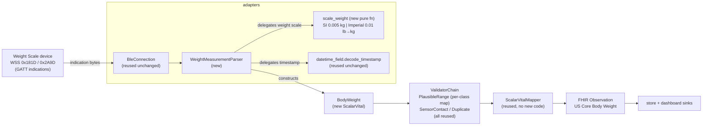

# Design Document

**Spec: weight-body-mass** (weight scale — fourth and final phase-2 slice)

## Overview

This design implements body-weight acquisition end to end by **reusing** the machinery the
blood-pressure, oxygen-saturation, and body-temperature slices put in place. Body weight is a single
scalar quantity (kilograms), so — like `HeartRate`, `OxygenSaturation`, and `BodyTemperature`, and
unlike `BloodPressure` — it lands as a new `ScalarVital` (`BodyWeight`). Being a `ScalarVital` means
the existing `ScalarVitalMapper` produces its Observation with **no new mapper code**, resolved
through the existing MRO registry.

The genuinely new logic in this slice is narrow but has one real trap: a Weight Measurement parser for
the Weight Scale Service characteristic `0x2A9D`, whose hardest part is a **unit-dependent uint16
scaling**. The weight value is a plain 16-bit integer whose real-world meaning depends on the flags
byte — `0.005 kg` per unit in SI mode, `0.01 lb` per unit in Imperial mode. These are *different
resolutions*, not one value plus an after-the-fact unit conversion; picking the wrong multiplier
yields a weight off by roughly a factor of two that still looks plausible. So unlike the temperature
slice (which added a shared IEEE-11073 32-bit FLOAT decoder), this slice adds **no** shared
`adapters/sfloat.py` code — weight uses neither SFLOAT nor FLOAT. The scaling is a small pure function
local to the weight parser. Everything else (the BLE lifecycle, the FHIR mapper, the shared
`decode_timestamp` helper, the duplicate and sensor-contact validators, the per-class plausible-range
validator) is reused unchanged.

Grounded in the current code (read during design): `vitals/base.py`,
`vitals/builtin/oxygen_saturation.py`, `vitals/builtin/body_temperature.py`, `vitals/__init__.py`,
`adapters/ble.py` (the reusable `BleConnection`), `adapters/sfloat.py`, `adapters/datetime_field.py`,
`adapters/temp_parser.py`, `adapters/builtin/{mock,thermometer_ble}.py`, `adapters/__init__.py`,
`fhir/mappers.py`, `fhir/__init__.py`, `validation/builtin/validators.py`, `pipeline/orchestrator.py`,
`config.py`, and `cli.py`. Traceability: each section cites the FR-WT-\*/NFR-WT-\* it satisfies, and a
full mapping is given at the end. The existing heart-rate, blood-pressure, oxygen-saturation, and
body-temperature suites (plus the dependency-direction test) are the regression guardrail; because this
slice touches no shared decoder module, that guardrail should stay green with zero changes to existing
files beyond the composition root, `config.py`, `.env.example`, and the `adapters`/`vitals` package
`__init__.py` exports.

### What is reused unchanged (the payoff of the earlier slices going first)

- **`BleConnection`** (`adapters/ble.py`) — the profile-agnostic scan/connect/subscribe/reconnect
  lifecycle. The weight adapter composes it with WSS UUIDs, exactly as `BloodPressureBleAdapter`,
  `PulseOximeterBleAdapter`, and `HealthThermometerBleAdapter` do. **No change to `BleConnection`** —
  including for indications; the temperature design already established that `bleak`'s `start_notify`
  transparently enables notifications *or* indications per the characteristic's declared properties
  (design §5).
- **`ScalarVitalMapper`** (`fhir/mappers.py`) — builds an Observation from a `ScalarVital`'s class
  metadata (`loinc_code`, `ucum_unit`, `us_core_profile`). `BodyWeight` resolves to it via the existing
  MRO registry in `fhir/__init__.py`. **No new mapper code.** (The mapper uses the vital's own
  `ucum_unit` as both the `valueQuantity.code` and `unit` display, so weight reads `kg` for both with
  no per-class display change.)
- **`decode_timestamp`** (`adapters/datetime_field.py`) — the shared host-local, tz-aware, 7-byte
  org.bluetooth date-time decode with `TIMESTAMP_SIZE = 7`, already used by the blood-pressure and
  temperature parsers. The weight parser imports and reuses it for the optional Weight Measurement
  timestamp. **No change.**
- **`DuplicateValidator`** — its scalar identity key `(device_id, effective, value)` already covers
  `BodyWeight`. **No change.**
- **`SensorContactValidator`** — reads `getattr(vital, "sensor_contact", None)`, so it passes body
  weight (which has no such field) through unchanged. **No change.**
- **`PlausibleRangeValidator`** — already a per-vital-class `overrides` map. Body weight is wired by
  adding a `BodyWeight` entry to that map in the composition root; **no validator code change**
  (design §7).

### What is new or changed

| Area | Change | Requirement |
|------|--------|-------------|
| `vitals/builtin/body_weight.py` | new `BodyWeight(ScalarVital)` | FR-WT-1 |
| `vitals/__init__.py` | export `BodyWeight` under `# Concrete defaults` | FR-WT-1 |
| `adapters/weight_parser.py` | **new** `WeightMeasurementParser` for `0x2A9D` + pure functions incl. the unit-dependent uint16 scaler | FR-WT-2, FR-WT-3 |
| `adapters/weight_parser.py` | reuse the shared `decode_timestamp` for the optional timestamp | FR-WT-3 |
| `adapters/builtin/weight_scale_ble.py` | new `WeightScaleBleAdapter` (composes `BleConnection`) | FR-WT-4 |
| `adapters/builtin/mock.py` | new `MockWeightAdapter` + `WeightEmissionMode` | FR-WT-8 |
| `adapters/__init__.py` | export `WeightScaleBleAdapter`, `MockWeightAdapter`, `WeightEmissionMode` | FR-WT-4, FR-WT-8 |
| `config.py` + `.env.example` | `VOF_WEIGHT_MIN` / `VOF_WEIGHT_MAX` | FR-WT-6 |
| `cli.py` | short names `weight` / `mock-weight`; wire weight bounds into the overrides map | FR-WT-8, FR-WT-6 |
| `fhir/builders.py` | CapabilityStatement note (search unchanged) | FR-WT-7 |
| `docs/protocol-weight-measurement.md` | **new** Bluetooth SIG + range-rationale citation | FR-WT-3, NFR-WT-4 |
| `docs/device-compatibility.md` | add a weight-scale compatibility row | FR-WT-8 |
| `docs/brief-config-file.md` | final phase-2 config-surface checkpoint | FR-WT-9 |

Dependency directions are unchanged; every new module lives in the package that already owns its
concern (`BodyWeight` in `vitals`, the parser/scaler/adapter in `adapters`), so
`test_dependency_directions.py` stays green (NFR-WT-2). Notably, `adapters/sfloat.py` and
`adapters/datetime_field.py` are **not** modified by this slice — the only shared-`adapters` reuse is
importing `decode_timestamp`.

---

## Architecture

The data path is identical in shape to the temperature, SpO2, and BP slices; only the concrete
adapter, parser, and vital type differ, and the decode primitive is a scaled uint16 rather than a
medical float:



`bleak` is imported lazily inside `BleConnection` only; the new adapter, parser, scaler, and mock never
import it at module level (FR-WT-4, NFR-WT-4). The orchestrator (`pipeline/orchestrator.py`) already
resolves the mapper per reading via `resolve_mapper(type(vital))`, so `BodyWeight → ScalarVitalMapper`
dispatches with no orchestrator change (FR-WT-5).

---

## Components and Interfaces

### 1. `BodyWeight` — `vitals/builtin/body_weight.py` (FR-WT-1)

A frozen `ScalarVital`, structurally identical to `OxygenSaturation` and `BodyTemperature` but for
weight. No new instance fields (the optional device user-ID, BMI, and height fields are not modelled —
see requirements Out of scope; length-accounted only, design §3):

```python
@dataclass(frozen=True, kw_only=True)
class BodyWeight(ScalarVital):
    loinc_code: ClassVar[str] = "29463-7"  # Body weight
    ucum_unit: ClassVar[str] = "kg"  # UCUM kilograms
    us_core_profile: ClassVar[str] = (
        "http://hl7.org/fhir/us/core/StructureDefinition/us-core-body-weight"
    )
    plausible_range: ClassVar[tuple[float, float]] = (2.0, 650.0)
```

Exported from `vitals/__init__.py` under `# Concrete defaults`. The existing `ScalarVital`
`__init_subclass__` enforcement fires because `loinc_code` is assigned, so a concrete subclass missing
any of the four required class variables raises at import time (FR-WT-1). No FHIR code in this package;
the LOINC/UCUM bindings are class metadata only, so a future non-FHIR target mapper can consume
`BodyWeight` without touching `vitals` (NFR-WT-3).

**Range rationale.** Default `(2.0, 650.0)` kg. As with the other vitals, these are
**physical-plausibility bounds, not clinical thresholds.** Their only job is to reject values that
could not have come from a real human body on a home scale — a decode error, a wrong-unit misread, a
scale returning garbage before the reading stabilizes — and *not* to judge whether a weight is
clinically low or high. Dropping a genuine extreme-but-real weight would violate the project's
faithful-representation mission, so the bounds are kept wide:

- **Lower bound `2.0` kg** sits below the low end of documented human weights (extremely low birth
  weight is well under 1 kg, but a consumer *standing* weight scale is not used on neonates; `2.0` kg
  admits the smallest realistic scale reading while rejecting a `0`/near-zero decode artifact or an
  empty-scale value).
- **Upper bound `650.0` kg** sits above the heaviest human weights ever documented (the heaviest
  recorded human weight is around `635` kg), so no real reading is discarded while clearly
  non-physiological values are rejected.

These bounds are recorded with citations in the new `docs/protocol-weight-measurement.md`
range-rationale note (design §11). The bounds are overridable via `VOF_WEIGHT_MIN` / `VOF_WEIGHT_MAX`
(FR-WT-6). Because normalization to kilograms happens in the parser (design §2–3), the validator always
compares against kilogram bounds regardless of the device's reporting unit.
*(Sources rephrased for licensing compliance; inline URLs given in the protocol doc.)*

**LOINC choice.** `29463-7` ("Body weight") is the code the US Core Body Weight profile is built
around, and the profile expects a scalar `valueQuantity` in `kg`. This is why body weight is a
`ScalarVital`, not a `ComponentVital` — recorded so it is not re-litigated.

### 2. Unit-dependent uint16 weight scaling — `adapters/weight_parser.py` (FR-WT-2)

**This is the single most important technical decision in the slice, so it is spelled out
explicitly.** The Weight Measurement value is a little-endian **uint16** whose real-world unit depends
on flags bit 0:

| Flags bit 0 | Unit | Per-unit resolution | Normalization to kg |
|-------------|------|---------------------|---------------------|
| `0` | SI (kilograms) | `0.005` kg | value × 0.005 |
| `1` | Imperial (pounds) | `0.01` lb | value × 0.01, then lb → kg |

The two multipliers are **different resolutions**, not the same number in different units. That is the
trap this design guards against: decoding an SI payload as Imperial (or vice versa) produces a value
wrong by roughly a factor of two that is close enough to look real. The scaler therefore selects the
resolution *from the flags byte* and, only in the Imperial branch, applies the pound→kilogram
conversion — both in one pure function so the branch cannot be split or mis-ordered by a caller:

```python
_SI_RESOLUTION_KG = 0.005  # kg per raw unit, SI mode
_IMPERIAL_RESOLUTION_LB = 0.01  # lb per raw unit, Imperial mode
_LB_TO_KG = 0.45359237  # exact pound → kilogram factor


def scale_weight(raw: int, *, imperial: bool) -> float:
    """Scale a raw uint16 Weight Measurement value to kilograms.

    In SI mode the raw value is 0.005 kg per unit. In Imperial mode it is
    0.01 lb per unit, then converted to kilograms. The two resolutions differ;
    the unit is chosen from the flags byte, never inferred from the value.
    """
    if imperial:
        return raw * _IMPERIAL_RESOLUTION_LB * _LB_TO_KG
    return raw * _SI_RESOLUTION_KG
```

- **Placement:** a pure function in the new `adapters/weight_parser.py`, next to the parser class that
  delegates to it — mirroring how the heart-rate, BP, PLX, and temperature parsers keep their
  byte-level logic in pure functions (FR-WT-2, FR-WT-3).
- **Not in `adapters/sfloat.py`:** weight is not an IEEE-11073 float, so the shared SFLOAT/FLOAT module
  is left untouched (FR-WT-2, NFR-WT-1). Reusing it would be miscategorization, not reuse.
- **Dependency direction:** the function depends only on the standard library and lives in `adapters`,
  adding no cross-package import (NFR-WT-2).

Alternative considered — a single "resolution" constant plus a post-scale unit conversion — rejected
because it obscures that SI and Imperial have *different* per-unit resolutions and invites exactly the
factor-of-two bug above.

### 3. `WeightMeasurementParser` — `adapters/weight_parser.py` (FR-WT-3)

Decodes GATT `0x2A9D` (Weight Measurement). Byte-level logic lives in pure functions the class
delegates to, mirroring `parser.py`, `bp_parser.py`, `plx_parser.py`, and `temp_parser.py`.

**Payload layout (Weight Measurement).** Flags byte (offset 0), then the mandatory weight **uint16**
(offsets 1–2), then optional fields gated by the flags:

- **bit 0 — unit**: `0` → SI (kg), `1` → Imperial (lb).
- **bit 1 — timestamp present**: a 7-byte org.bluetooth date-time follows the weight field.
- **bit 2 — user ID present**: a 1-byte user-ID field follows (after the timestamp, if present). Not
  modelled; length-accounted only; never logged or stored (NFR-WT-5).
- **bit 3 — BMI and height present**: a BMI uint16 and a height uint16 (4 bytes total) follow. Not
  modelled; length-accounted only.

Pure functions:

```python
def parse_weight_flags(byte: int) -> WeightFlags     # decode bits 0..3
def required_length(flags: WeightFlags) -> int       # 1 + weight(2) + optional ts(7)/user(1)/bmi+ht(4)
def scale_weight(raw: int, *, imperial: bool) -> float   # §2
```

`WeightMeasurementParser(GattCharacteristicParser)` sketch:

```python
def __init__(self, device_id: str, now: Callable[[], datetime] | None = None) -> None:
    self._device_id = device_id
    self._now = now if now is not None else (lambda: datetime.now().astimezone())  # tz-aware local


def parse(self, data: bytes) -> VitalSign | None:
    if len(data) < 1:
        return None
    flags = parse_weight_flags(data[0])
    if len(data) < required_length(flags):
        return None
    raw = int.from_bytes(data[_WEIGHT_OFFSET : _WEIGHT_OFFSET + 2], "little")
    value_kg = scale_weight(raw, imperial=flags.unit_is_imperial)
    if flags.timestamp_present:
        effective = decode_timestamp(data, _TIMESTAMP_OFFSET)  # offset 3 (1 + weight 2)
        if effective is None:  # invalid calendar date → drop
            return None
    else:
        effective = self._now()
    return BodyWeight(effective=effective, device_id=self._device_id, value=value_kg)
```

- Malformed/short/invalid-timestamp → `None`; the adapter drops it, logging at `DEBUG` with byte length
  only, never the value (FR-WT-3, NFR-WT-5).
- The timestamp offset is `1 + 2 = 3` (flags + weight uint16); the user-ID and BMI/height fields follow
  the timestamp when present and are counted by `required_length` only (FR-WT-3).
- Byte-level decoding is pure functions the class delegates to, using `scale_weight` and the shared
  `decode_timestamp` (FR-WT-3).
- `docs/protocol-weight-measurement.md` cites the WSS / Weight Measurement spec (FR-WT-3, NFR-WT-4).

### 4. `WeightScaleBleAdapter` — `adapters/builtin/weight_scale_ble.py` (FR-WT-4)

A near-exact analogue of `HealthThermometerBleAdapter`: subclasses `DeviceAdapter` directly, composes a
`BleConnection` configured for the WSS profile, and delegates the lifecycle:

```python
WEIGHT_SCALE_SERVICE_UUID = "0000181d-0000-1000-8000-00805f9b34fb"  # 0x181D
WEIGHT_MEASUREMENT_UUID = "00002a9d-0000-1000-8000-00805f9b34fb"  # 0x2A9D


class WeightScaleBleAdapter(DeviceAdapter):
    supported_vitals = (BodyWeight,)

    def __init__(self, *, device_name=None, on_state_change=None, now=None):
        self._now = now
        self._connection = BleConnection(
            service_uuid=WEIGHT_SCALE_SERVICE_UUID,
            characteristic_uuid=WEIGHT_MEASUREMENT_UUID,
            matches=self.matches,
            parser_factory=self._build_parser,
            device_name=device_name,
            on_state_change=on_state_change,
        )

    def matches(self, advertisement) -> bool:
        return True  # service-UUID scan is authoritative

    @property
    def device_info(self) -> DeviceInfo:
        return DeviceInfo(
            manufacturer="Generic",
            model="Weight Scale",
            identifiers={"profile": "org.bluetooth.service.weight_scale"},
        )

    # state/connect/disconnect/vitals delegate to self._connection
    def _build_parser(self):
        from vitals_on_fhir.adapters.weight_parser import WeightMeasurementParser

        return WeightMeasurementParser(
            device_id=self.device_info.identifiers["profile"], now=self._now
        )
```

`bleak` stays lazily imported inside `BleConnection` only (FR-WT-4, NFR-WT-4). The parser import inside
`_build_parser` is lazy to avoid an import cycle (`weight_parser` imports `adapters.ble`), matching the
BP, SpO2, and temperature adapters. Composition (not inheritance) keeps the adapter within the
object-model 3-level cap (FR-WT-4).

### 5. Indications vs notifications — already resolved (FR-WT-4)

Like the HTS Temperature Measurement characteristic, the WSS Weight Measurement characteristic `0x2A9D`
is delivered via GATT **indications** (acknowledged). The body-temperature design investigated this in
depth and established the finding this slice relies on: `BleConnection` subscribes with a single
`await client.start_notify(...)` and `bleak` **transparently enables notifications *or* indications**
per the characteristic's declared properties/CCCD, delivering both through the same callback signature.
So targeting `0x2A9D` requires only passing its service/characteristic UUIDs into the existing
`BleConnection` constructor — no shared-lifecycle change, no `**Breaking:**` note (NFR-WT-1). The
residual risk (a real device requiring an explicit indication subscription bleak does not infer) lives
entirely behind the `hardware` marker and, if ever observed, would be a minimal *additive*
accommodation to `BleConnection` with its own changelog note — not a silent change made here. This
design makes no such change because the evidence says it is not required.

**Valid hardware test targets — not every "smart scale."** This adapter targets the *standard* Weight
Scale Service (`0x181D` / `0x2A9D`). Many consumer body-composition scales — including the RENPHO Elis 1
(`amazon.com/dp/B01N1UX8RW`) and similar bioimpedance (BIA) scales — do **not** expose the standard WSS;
they use a **proprietary** BLE protocol (vendor UART-style services and custom framed packets) and/or a
vendor cloud API. Such a device will not exercise `WeightScaleBleAdapter` at all: a `hardware`-marked
test run against one would appear to "fail" when it is actually a device-protocol mismatch, not an
adapter defect. A valid hardware target is therefore a **standards-compliant** weight scale that
advertises `0x181D` with a `0x2A9D` characteristic — confirm with a BLE scan (your own packet capture is
an allowed protocol source per `security-privacy.md`) before treating a device as a test target.
Proprietary-BLE scales like the RENPHO are out of scope for this slice and are the motivating use case
for the **phase-3 phone-aggregator** path (RENPHO app → Health Connect / Apple Health → aggregator
adapter → pipeline), recorded in `docs/roadmap.md`; do not build that here. This note keeps a future
hardware-test attempt from misdiagnosing a protocol mismatch as a bug.

### 6. `MockWeightAdapter` — `adapters/builtin/mock.py` (FR-WT-8)

Add a parallel `MockWeightAdapter` + `WeightEmissionMode`, mirroring `MockAdapter`,
`MockBloodPressureAdapter`, `MockOximeterAdapter`, and `MockThermometerAdapter`, emitting `BodyWeight`,
never importing `bleak`:

```python
class WeightEmissionMode(enum.Enum):
    VALID = "valid"  # e.g. 70.0 kg, inside the plausible range
    IMPLAUSIBLE = "implausible"  # outside the plausible range (e.g. 900.0 kg)
    IMPERIAL_SOURCE = "imperial"  # a valid reading whose kilogram value corresponds to a
    # normalized Imperial source (e.g. 154.32 lb → 70.0 kg),
    # exercising the normalization path end to end
```

Notes:
- The mock emits **domain objects** (`BodyWeight`, always kilograms), so the `IMPERIAL_SOURCE` mode
  emits a `BodyWeight` whose `value` is the *already-normalized* kilogram equivalent, documenting the
  normalization contract at the adapter boundary. The byte-level unit-scaling-plus-normalization logic
  itself is exercised by the parser tests against raw payloads (design §10 Testing), which is where the
  SI/Imperial resolution choice actually lives.
- `MockWeightAdapter` mirrors the other mocks' `connect`/`disconnect`/`state`/`vitals`/`count` shape
  exactly. Exported from `adapters/__init__.py` under `# Concrete defaults`.

### 7. Validation wiring + per-vital-class plausibility (FR-WT-6)

No validator code changes. The `PlausibleRangeValidator` is already a per-vital-class `overrides`-map
validator. Body weight is wired by adding one entry to the map the composition root builds (design §10):

```python
scalar_overrides = {
    HeartRate: (settings.hr_min, settings.hr_max),
    OxygenSaturation: (settings.spo2_min, settings.spo2_max),
    BodyTemperature: (settings.temp_min, settings.temp_max),
    BodyWeight: (settings.weight_min, settings.weight_max),  # new
}
```

Lookup is per reading: `overrides[type(vital)]` if present, else the class's `plausible_range`. So
`VOF_WEIGHT_*` bounds apply **only** to `BodyWeight` readings and never cross-apply to other vitals, and
vice versa (FR-WT-6). `DuplicateValidator` (scalar identity key covers weight) and
`SensorContactValidator` (passes non-HR vitals through) are unchanged. Rejections log at `INFO` with the
bounds only, never the value (FR-WT-6, NFR-WT-5).

### 8. FHIR mapping — reused, no code (FR-WT-5)

`BodyWeight` is a `ScalarVital`, and `fhir/__init__.py` already registers `ScalarVitalMapper` for
`ScalarVital`. `resolve_mapper(BodyWeight)` walks the MRO and returns `ScalarVitalMapper`, which builds
the Observation from `BodyWeight`'s class metadata: panel `code` `29463-7`, `valueQuantity` with UCUM
`code` `kg` and `value` the kilogram weight, `meta.profile` the US Core Body Weight URL, `status`
`final`, category `vital-signs`. No registration, no mapper subclass, no change to `fhir/`. The other
vitals' mapper resolution is unchanged (FR-WT-5). Construction goes through `Observation.model_validate`,
so model validation runs at build time; a validation failure propagates to the orchestrator boundary,
which logs at `ERROR` (no value) and does not store/serve (FR-WT-5, NFR-WT-3).

### 9. Configuration — `config.py` + `.env.example` (FR-WT-6)

```python
# Validation bounds — body weight (kg); physical-plausibility, not clinical (design §1)
weight_min: float = 2.0
weight_max: float = 650.0
```

`env_prefix="VOF_"` maps these to `VOF_WEIGHT_MIN` / `VOF_WEIGHT_MAX`; `extra="forbid"` still rejects
unknown vars. Both added to `.env.example` with comments. Config is loaded once in `cli.py` and passed
explicitly; no module-level global, no mutation after startup (tech steering). Surface after this slice:
the `VOF_*` count grows by two (checkpoint update in `docs/brief-config-file.md`, design §11).

### 10. CLI wiring — `cli.py` (FR-WT-8, FR-WT-6)

- `_resolve_adapter`: add `"weight"` → `WeightScaleBleAdapter(device_name=settings.device_name)` and
  `"mock-weight"` → `MockWeightAdapter()`, alongside the existing `mock`, `mock-bp`, `mock-spo2`,
  `mock-temp`, `miband10`, `bp`, `spo2`, `temp` names; update the `--adapter` help text and the
  `ValueError`/argparse strings to list the new names.
- `_build_orchestrator`: add the `BodyWeight: (settings.weight_min, settings.weight_max)` entry to the
  `PlausibleRangeValidator` `scalar_overrides` map (no validator code change; `DuplicateValidator` and
  `SensorContactValidator` unchanged). Confirm no orchestrator change is needed (per-vital
  `resolve_mapper` already dispatches `BodyWeight → ScalarVitalMapper`).
- Import `BodyWeight` from `vitals` and `WeightScaleBleAdapter`/`MockWeightAdapter` from `adapters` at
  the top of `cli.py` (the composition root is permitted to import concrete classes from every package).
- Scripted no-server check: `uv run vitals-on-fhir --adapter mock-weight` produces weight Observations
  reaching the store/dashboard (no hardware). Do not add tests that depend on a running server.

### 11. Docs deliverables (FR-WT-3, FR-WT-9, NFR-WT-4)

- **`docs/protocol-weight-measurement.md` (new).** Cite the Bluetooth SIG Weight Scale Service
  (`0x181D`) / Weight Measurement characteristic (`0x2A9D`), the GATT Specification Supplement (flags
  byte, uint16 weight field, SI vs Imperial resolution, optional timestamp/user-ID/BMI-height fields and
  offsets), and Assigned Numbers — each with name, version, and URL/date. State the SI (`0.005` kg) vs
  Imperial (`0.01` lb → kg) resolution rule and the pound→kilogram normalization, the host-local
  tz-aware timestamp convention (reference the blood-pressure doc), the decision *not* to model the
  user-ID/BMI/height fields (and that the user ID is never decoded or logged, per NFR-WT-5), and that no
  code was copied from other projects; include the Bluetooth SIG trademark notice. Add a
  **range-rationale note** recording the evidence behind the `(2.0, 650.0)` kg physical-plausibility
  bounds (heaviest documented human weight ~635 kg for the ceiling; smallest realistic standing-scale
  reading for the floor), with inline source URLs, paraphrased for licensing compliance.
- **`docs/device-compatibility.md`.** Add a compatibility row for standard-profile BLE weight scales.
- **`docs/brief-config-file.md` (final phase-2 checkpoint).** Add the "Checkpoint — after body weight"
  subsection recording that the counted `VOF_*` surface reaches **19** (12 per-vital range keys) after
  `VOF_WEIGHT_*`, with an explicit "awkward?" judgment. As body weight is the final phase-2 vital, this
  checkpoint closes the phase-2 length-driver assessment and gives the recommendation (promote the
  `config.yaml` idea to its own spec, or leave it as an idea) with the completed range-key surface in
  front of it. Records count + judgment only; builds no config layer, consistent with the brief's
  guardrails.

---

## Correctness Properties

These are the properties the Testing Strategy verifies with Hypothesis (≥100 iterations each), one test
per property, tagged with the property name.

- **Property 1 — Unit-scaling correctness.** For any raw uint16 and either unit flag, `scale_weight`
  returns `raw × 0.005` in SI mode and `raw × 0.01 × 0.45359237` in Imperial mode, always in kilograms,
  and the SI and Imperial results for the same raw value differ (the multipliers are not
  interchangeable).
- **Property 2 — Parser never crashes on arbitrary bytes.** For any `bytes`, `WeightMeasurementParser.parse`
  returns a `BodyWeight` or `None`, never raises.
- **Property 3 — Well-formed payload build → parse round-trip.** For any generated kilogram value
  (within representable resolution) and any optional-field flag combination, a built payload parses back
  to a `BodyWeight` whose `value` equals the source within tolerance; when the timestamp flag is set to a
  generated valid date-time, `effective` equals that date-time host-local, tz-aware; otherwise a pinned
  injected clock is used.
- **Property 4 — Imperial normalization correctness.** For any generated kilogram value, an
  Imperial-flagged payload encoding the equivalent raw pounds and an SI-flagged payload encoding the
  equivalent raw kilograms parse to `value` results equal within tolerance (both `≈ C`).
- **Property 5 — Per-class bounds applied with no cross-application.** For any overrides map and any
  scalar reading, the bounds applied are exactly that reading's own class bounds; accepted iff in range;
  a weight override never changes a non-weight reading's decision.

## Testing Strategy

- **Unit / example tests:** `parse_weight_flags` bit decode; `required_length` across every
  optional-field combination; `scale_weight` on known SI and Imperial pairs; `__init_subclass__`
  metadata test for `BodyWeight`; mapper test asserting a valid US Core Body Weight Observation (`value`,
  UCUM `kg`, LOINC `29463-7`); search-by-`code` and CapabilityStatement tests; a duplicate-rejection
  test on `(device_id, effective, value)`.
- **Property tests (Hypothesis, ≥100 iterations):** the five Correctness Properties above, placed next
  to the code they cover and tagged `# Feature: weight-body-mass, Property N: <name>`.
- **Adapter/lifecycle tests:** `MockWeightAdapter` emission modes (VALID / IMPLAUSIBLE / IMPERIAL_SOURCE)
  and a never-imports-`bleak` AST check; `WeightScaleBleAdapter` satisfies the reusable `DeviceAdapter`
  contract suite and the `BleConnection` behavior (state transitions, drop-`None`, disconnect unblocks
  `vitals()`, a quiet interval while connected is not a disconnection).
- **Regression guardrail:** the existing HR, BP, SpO2, and temperature suites plus
  `tests/test_dependency_directions.py` remain green — in particular confirming `adapters/sfloat.py` and
  `adapters/datetime_field.py` are untouched.
- **Hardware:** real-weight-scale tests carry the `hardware` marker and are excluded from CI.

---

## Requirements mapping

| Requirement | Design section(s) |
|-------------|-------------------|
| FR-WT-1 (BodyWeight type) | §1 |
| FR-WT-2 (unit-scaled uint16 decode) | §2 |
| FR-WT-3 (Weight Measurement parsing) | §3, §11 |
| FR-WT-4 (BLE via shared lifecycle) | §4, §5 |
| FR-WT-5 (FHIR mapping, reused) | §8 |
| FR-WT-6 (per-class plausibility) | §7, §9, §10 |
| FR-WT-7 (API / CapabilityStatement) | §8, §11 |
| FR-WT-8 (adapter selection + mock) | §4, §6, §10 |
| FR-WT-9 (config-surface checkpoint) | §11 |
| NFR-WT-1 (no breaking changes) | §2, §5, "What is new" table |
| NFR-WT-2 (dependency directions) | §2, §3, "What is new" table |
| NFR-WT-3 (interoperability) | §1, §8 |
| NFR-WT-4 (provenance/licensing) | §11 |
| NFR-WT-5 (security/privacy) | §3, §7, §11 |
| NFR-WT-6 (test coverage) | Correctness Properties, Testing Strategy |
