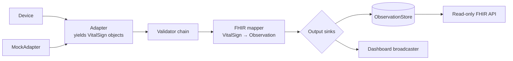

# vitals-on-fhir

**Consumer wearables and home health devices → HL7® FHIR® R4.**

`vitals-on-fhir` is an open-source interoperability layer. It acquires vital signs from commercially available devices through open, standardized channels and exposes them as standards-compliant HL7 FHIR Observations. The project focuses on the bridge. Downstream apps, analytics, and clinical decision support are left to whoever consumes the FHIR API.

> **Status:** early development (spec-driven). Commands, endpoints, and class names below describe the target MVP and may change until the first release.

> **Not a medical device.** This is a research and educational proof-of-concept for healthcare interoperability. It must not be used for diagnosis, treatment, or any clinical decision-making.

---

## Why

Most wearables lock their data inside proprietary apps and clouds. Yet many of them, like most home health devices, can speak open Bluetooth standards. `vitals-on-fhir` turns those open channels into a single, vendor-neutral FHIR interface. Any FHIR-capable system (an EHR sandbox, a research pipeline, a caregiver dashboard) can then consume patient-generated vital signs without device-specific integrations.

## MVP scope

| In scope (MVP) | Out of scope (MVP) |
|---|---|
| Real-time heart rate via the standard Bluetooth **Heart Rate Service** (GATT `0x180D`) | Other vital signs (the class hierarchy is ready for them; see [Roadmap](#roadmap)) |
| One connected device at a time | Multiple simultaneous devices |
| Extensible object model: abstract base classes for vital signs, device adapters, validators, stores, output sinks, and authentication | Patient management, clinical decision support |
| Concrete adapters: `MiBand10Adapter` (reference device) and `MockAdapter` (simulated data) | Writing to external EHRs or FHIR servers |
| Validation that discards invalid or implausible measurements | Remote/cloud deployment |
| FHIR R4 `Observation` generation (US Core heart-rate profile, LOINC `8867-4`) | Historical data stored on the device |
| Local, **read-only FHIR REST API** with token authentication | Proprietary or reverse-engineered device protocols |
| Live web dashboard: current HR, timestamp, connection status | Persistence beyond memory |

## How it works



1. An **adapter** connects to a device and yields immutable **vital-sign objects**, such as a `HeartRate(value=72, …)`. Adapters know nothing about FHIR.
2. A **validator chain** accepts or rejects each vital-sign object (plausible range, sensor contact, duplicates).
3. A **FHIR mapper** turns each accepted object into an R4 `Observation`, using metadata declared on the vital-sign class (LOINC code, UCUM unit, US Core profile).
4. The Observation goes to every registered **output sink**: the observation store, which serves the read-only FHIR API, and the dashboard broadcaster, which pushes it over WebSocket.

## Extending vitals-on-fhir

Every extension point is an abstract base class (ABC). The project ships concrete defaults, and you add your own by subclassing.

| Extension point | ABCs | Shipped concrete classes |
|---|---|---|
| **Vital-sign types** | `VitalSign` → `ScalarVital`, `ComponentVital` | `HeartRate` |
| **Device adapters** | `DeviceAdapter` → `BleHeartRateAdapter` | `MiBand10Adapter`, `MockAdapter` |
| **Validators** | `Validator` | `PlausibleRangeValidator`, `SensorContactValidator`, `DuplicateValidator` |
| **FHIR mappers** | `VitalMapper` | `ScalarVitalMapper`, `ComponentVitalMapper` |
| **Stores** | `ObservationStore` | `InMemoryObservationStore` |
| **Output sinks** | `ObservationSink` | `InMemoryObservationStore`, `DashboardBroadcaster` |
| **Authentication** | `Authenticator` | `StaticTokenAuthenticator` |

### Vital signs

Each class describes a *kind* of vital sign through class-level metadata. Each *instance* is one immutable measurement. The hierarchy mirrors US Core: a base vital-signs profile, with blood pressure as the one profile built from components.

```
VitalSign (ABC)
├── ScalarVital (ABC)      → HeartRate            (roadmap: OxygenSaturation, BodyTemperature, BodyWeight, RespiratoryRate)
└── ComponentVital (ABC)   → (roadmap: BloodPressure)
```

```python
@dataclass(frozen=True, kw_only=True)
class HeartRate(ScalarVital):
    loinc_code = "8867-4"
    ucum_unit = "/min"
    us_core_profile = "http://hl7.org/fhir/us/core/StructureDefinition/us-core-heart-rate"
    plausible_range = (20.0, 250.0)
    sensor_contact: bool | None = None
```

Required metadata is checked when a subclass is defined, so a vital sign without a LOINC code fails at import time. A new *scalar* vital sign needs no mapper code, because `ScalarVitalMapper` builds the Observation from the class metadata.

### Device adapters

| Class | Kind | Extend it when… |
|---|---|---|
| `DeviceAdapter` | ABC | Your device uses any channel (another BLE profile, a file export, an aggregator, …) |
| `BleHeartRateAdapter` | ABC | Your device speaks the standard Heart Rate Service. The base handles scanning, subscribing, parsing, and reconnection |
| `MiBand10Adapter` | Concrete | Shipped reference implementation |
| `MockAdapter` | Concrete | Shipped simulated-data implementation |

A compatible Heart Rate Service device typically needs only this:

```python
class MyStrapAdapter(BleHeartRateAdapter):
    def matches(self, advertisement: AdvertisementInfo) -> bool:
        return advertisement.local_name.startswith("MyStrap")

    @property
    def device_info(self) -> DeviceInfo:
        return DeviceInfo(manufacturer="Acme", model="MyStrap 2")
```

Select it without modifying this repository by passing its import path:

```bash
uv run vitals-on-fhir --adapter mypackage.adapters.MyStrapAdapter
```

## Device compatibility

| Device | Status |
|---|---|
| Xiaomi Smart Band 10 (HR broadcast enabled) | Shipped: `MiBand10Adapter` |
| Other devices with HR broadcast (e.g., some Amazfit, Garmin, Polar, Coros models) | Supported by subclassing `BleHeartRateAdapter`; unverified |
| BLE chest straps (standard Heart Rate Service) | Supported by subclassing `BleHeartRateAdapter`; unverified |
| Apple Watch, Oura, most Wear OS watches | Not supported: no native open real-time channel |

Please report devices you've tested, or contribute your adapter, via an issue.

**Known limitations of the standard channel:** it streams live data only (no stored history), provides device-computed beats per minute rather than raw PPG, may require an active workout mode on some devices, and is unauthenticated at the Bluetooth level (see [Security](#security--privacy)).

## FHIR output

Each accepted heart-rate measurement becomes an Observation conforming to the [US Core Heart Rate profile](http://hl7.org/fhir/us/core/StructureDefinition/us-core-heart-rate):

```json
{
  "resourceType": "Observation",
  "id": "example-hr-1",
  "meta": {
    "profile": ["http://hl7.org/fhir/us/core/StructureDefinition/us-core-heart-rate"]
  },
  "status": "final",
  "category": [{
    "coding": [{
      "system": "http://terminology.hl7.org/CodeSystem/observation-category",
      "code": "vital-signs",
      "display": "Vital Signs"
    }]
  }],
  "code": {
    "coding": [{ "system": "http://loinc.org", "code": "8867-4", "display": "Heart rate" }]
  },
  "subject": { "reference": "Patient/local-patient" },
  "device": { "reference": "Device/xiaomi-smart-band-10" },
  "effectiveDateTime": "2026-09-21T18:04:12.345Z",
  "issued": "2026-09-21T18:04:12.402Z",
  "valueQuantity": {
    "value": 72,
    "unit": "beats/minute",
    "system": "http://unitsofmeasure.org",
    "code": "/min"
  }
}
```

`effectiveDateTime` is when the measurement was taken. `issued` is when `vitals-on-fhir` produced the Observation.

## FHIR API (read-only)

All requests require `Authorization: Bearer <token>`. Responses use `application/fhir+json`, and search results are FHIR `Bundle`s (`type: searchset`).

| Method | Endpoint | Description |
|---|---|---|
| `GET` | `/fhir/metadata` | `CapabilityStatement` |
| `GET` | `/fhir/Observation` | Search. Supports `code`, `date`, `_sort=-date`, `_count` |
| `GET` | `/fhir/Observation/{id}` | Read one Observation |
| `GET` | `/fhir/Patient/{id}` | Read the configured local Patient |
| `GET` | `/fhir/Device/{id}` | Read the connected Device |

```bash
curl -H "Authorization: Bearer $VOF_API_TOKEN" \
  "http://localhost:8000/fhir/Observation?code=http://loinc.org|8867-4&_sort=-date&_count=10"
```

## Quick start

**Requirements:** Python 3.12+, [uv](https://docs.astral.sh/uv/), and a Bluetooth LE adapter (only for real devices; the mock adapter needs none, and the Bluetooth library isn't even loaded).

```bash
git clone https://github.com/soroushdty/vitals-on-fhir.git
cd vitals-on-fhir
uv sync
cp .env.example .env          # then set VOF_API_TOKEN
```

**Run with simulated data (no device needed):**

```bash
uv run vitals-on-fhir --adapter mock
```

**Run with a Xiaomi Smart Band 10:**

1. Enable heart-rate broadcast on the band (a heart-rate sharing setting; its location varies by firmware).
2. Make sure the band isn't connected to another app that holds its only BLE connection.
3. Start the service:

```bash
uv run vitals-on-fhir --adapter miband10
```

Then open `http://localhost:8000` and enter your token.

## Configuration

Configuration comes from environment variables (or `.env`). Unknown `VOF_*` variables are rejected at startup to catch typos.

| Variable | Default | Description |
|---|---|---|
| `VOF_API_TOKEN` | *(required)* | Token for the API and dashboard |
| `VOF_HOST` | `127.0.0.1` | Bind address. Localhost by default |
| `VOF_PORT` | `8000` | HTTP port |
| `VOF_ADAPTER` | `mock` | `mock`, `miband10`, or a fully qualified class path (`package.module.ClassName`) |
| `VOF_DEVICE_NAME` | *(none)* | Optional BLE name filter for device discovery |
| `VOF_HR_MIN` / `VOF_HR_MAX` | `20` / `250` | Override the heart-rate plausibility range (bpm) |
| `VOF_PATIENT_ID` | `local-patient` | ID of the local Patient resource |
| `VOF_STORE_MAX` | `10000` | Maximum Observations kept in memory |

## Development

```bash
uv run pytest                  # fast suite (no hardware required)
uv run pytest -m hardware      # tests that need a real device
uv run ruff check .            # lint
uv run ruff format .           # format
uv run mypy src                # type check
```

- **CI** (GitHub Actions) runs lint, type checks, and the fast test suite on every push and pull request.
- **Architecture is enforced by tests.** `tests/test_dependency_directions.py` parses every module and fails if a package imports one it shouldn't (for example, adapters importing FHIR code). Run it after adding cross-package imports.
- **Contract tests** check that every concrete adapter satisfies the `DeviceAdapter` contract, and that no ABC can be instantiated directly.
- **Property-based tests** (Hypothesis) check that the BLE payload parser never crashes on arbitrary bytes and round-trips valid payloads.
- **`CHANGELOG.md`** records significant changes: implemented specs, public API changes, config changes, and steering updates.

### Project structure

```
vitals-on-fhir/
├── src/vitals_on_fhir/
│   ├── vitals/          # VitalSign ABCs + builtin/ (HeartRate), DeviceInfo — depends on nothing
│   ├── adapters/        # DeviceAdapter, BleHeartRateAdapter, payload parsers + builtin/ (MiBand10Adapter, MockAdapter)
│   ├── validation/      # Validator ABC, ValidationResult, validator chain + builtin validators
│   ├── fhir/            # VitalMapper ABC + mappers, Device/Patient/CapabilityStatement builders
│   ├── pipeline/        # ObservationSink ABC, orchestration (adapter → validators → mapper → sinks)
│   ├── store/           # ObservationStore ABC + InMemoryObservationStore
│   ├── api/             # Read-only FHIR REST API, Authenticator ABC + StaticTokenAuthenticator
│   ├── dashboard/       # Static dashboard + DashboardBroadcaster sink
│   ├── config.py        # Settings
│   └── cli.py           # Composition root: wires concrete classes together
├── tests/               # Mirrors src/, plus dependency-direction and contract tests
├── docs/                # SRS, architecture, decisions, protocol sources
├── CHANGELOG.md
└── .kiro/steering/      # AI-assistant steering docs
```

Each package's `__init__.py` exports its public API, grouped into ABCs and concrete defaults. Import from the package, not from internal modules.

## Roadmap

1. **Heart rate from wearables** (standard BLE Heart Rate Service). *MVP*
2. **Home health devices** via standard Bluetooth health profiles: new `ScalarVital` and `ComponentVital` subclasses for blood pressure, pulse oximetry, temperature, and weight, plus a generalized BLE adapter with per-profile payload parsers and support for store-and-forward readings.
3. **Phone health aggregators** (Android Health Connect, Apple HealthKit) as new `DeviceAdapter` subclasses.
4. **Persistence and outbound integration**: durable `ObservationStore` implementations, an `ObservationSink` that pushes to external FHIR servers, SMART on FHIR as an `Authenticator`, and adapter discovery through Python entry points.
5. **Additional concrete adapters**, contributed or third-party, including optional device-specific ones as separately licensed packages with clean-room implementations and documented provenance.

## Security & privacy

- The API and dashboard require a bearer token. The service binds to `127.0.0.1` by default.
- Observations are kept **in memory only** in the MVP and are lost on restart.
- The Bluetooth Heart Rate Service is **unauthenticated**: while broadcast is enabled, any nearby device can read the heart-rate stream. Disable broadcast when not in use.
- The MVP is not designed for exposure to untrusted networks and is not HIPAA-compliant. Don't use it with real patient data in production settings.

## Standards

- [HL7 FHIR R4](https://hl7.org/fhir/R4/) and the [US Core](https://www.hl7.org/fhir/us/core/) vital-signs profiles
- [LOINC](https://loinc.org/) `8867-4` (Heart rate) and [UCUM](https://ucum.org/) units
- Bluetooth SIG Heart Rate Service / Heart Rate Measurement characteristic (`0x180D` / `0x2A37`)
- HL7 Personal Health Device (PHD) Implementation Guide (reference for the roadmap)

## Related work

- Open-source HL7 FHIR framework for real-time biomedical signal acquisition (MDPI *Applied Sciences*, 2025): <https://www.mdpi.com/2076-3417/15/23/12803>
- Medplum, "From BLE to FHIR": <https://www.medplum.com/blog/ble-to-fhir-anybio-medplum>
- Gadgetbridge (open-source companion app for many wearables): <https://codeberg.org/Freeyourgadget/Gadgetbridge>

## Academic context

This project started as a team project for **BMI 540** in the Biomedical Informatics and Data Science program at Arizona State University.

**Team:** `Soroush Dianaty, MD`, `Nusrat Ashrafi, MS`, `Isha Uttham, BS`
**Instructor:** `Shetty Sheetal, PhD`

## Contributing

Contributions are welcome. Please open an issue before starting significant work, and add a `CHANGELOG.md` entry for any change to public APIs, configuration, or architecture. By contributing, you agree that your contributions are licensed under AGPL-3.0. Include attribution and license information for any third-party code.

## Citation

If you use `vitals-on-fhir` in research, please cite it using the metadata in [`CITATION.cff`](CITATION.cff). A preprint is planned.

## Acknowledgments

Some architectural patterns and test utilities are adapted from [EviTrace](https://github.com/soroushdty/EviTrace) (GPL-3.0) by the same author. See [`NOTICE`](NOTICE).

## License

Licensed under the [GNU Affero General Public License v3.0](LICENSE). If you modify `vitals-on-fhir` and make it available to users over a network, you must offer them the corresponding source code.

HL7® and FHIR® are registered trademarks of Health Level Seven International. This project is not affiliated with or endorsed by HL7. Device names are used only to describe compatibility and do not imply endorsement.
