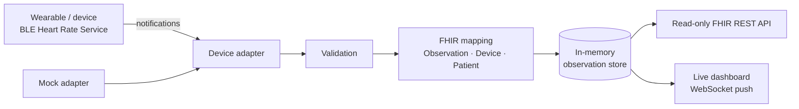

# vitals-on-fhir

**Consumer wearables and home health devices → HL7® FHIR® R4.**

`vitals-on-fhir` is an open-source interoperability layer. It acquires vital signs from commercially available devices through open, standardized channels and exposes them as standards-compliant HL7 FHIR Observations. The project focuses on the bridge. Downstream apps, analytics, and clinical decision support are left to whoever consumes the FHIR API.

> **Status:** early development (spec-driven). Commands and endpoints below describe the target MVP interface and may change until the first release.

> **Not a medical device.** This is a research and educational proof-of-concept for healthcare interoperability. It must not be used for diagnosis, treatment, or any clinical decision-making.

---

## Why

Most wearables lock their data inside proprietary apps and clouds. Yet many of them, like most home health devices, can speak open Bluetooth standards. `vitals-on-fhir` turns those open channels into a single, vendor-neutral FHIR interface. Any FHIR-capable system (an EHR sandbox, a research pipeline, a caregiver dashboard) can then consume patient-generated vital signs without device-specific integrations.

## MVP scope

| In scope (MVP) | Out of scope (MVP) |
|---|---|
| Real-time heart rate via the standard Bluetooth **Heart Rate Service** (GATT `0x180D`) | Other vital signs (see [Roadmap](#roadmap)) |
| One connected device at a time (tested with a Xiaomi Smart Band 10) | Multiple simultaneous devices |
| Mock adapter with simulated data for development and CI | Patient management, clinical decision support |
| Validation and discarding of invalid or corrupted measurements | Writing to external EHRs or FHIR servers |
| FHIR R4 `Observation` generation (US Core heart-rate profile, LOINC `8867-4`) | Remote/cloud deployment |
| Local, **read-only FHIR REST API** | Historical data stored on the device |
| Live web dashboard: current HR, timestamp, connection status | Proprietary or reverse-engineered device protocols |
| Token (API-key) authentication for the API and dashboard | |

## How it works



1. A **device adapter** connects to a device and emits raw measurements. The MVP ships a standard BLE Heart Rate Service adapter and a mock adapter behind the same interface. New devices and channels are added as new adapters.
2. **Validation** parses each payload per the Bluetooth Heart Rate Measurement spec. It discards invalid, incomplete, or implausible readings.
3. **FHIR mapping** converts each valid reading into an R4 `Observation`. The Observation references a `Device` (manufacturer/model, for provenance) and a configured local `Patient`.
4. Observations are served through a **read-only FHIR API** and pushed to the **dashboard** in real time.

## Device compatibility

The MVP works with any device that exposes the standard Bluetooth Heart Rate Service. No reverse engineering is needed. Many trackers support this through a "heart rate broadcast" or "share heart rate" mode, which usually must be enabled manually on the device or in its companion app.

| Device | Status |
|---|---|
| Xiaomi Smart Band 10 (HR broadcast enabled) | Reference test device |
| Other devices with HR broadcast (e.g., some Amazfit, Garmin, Polar, Coros models) | Expected to work; unverified |
| BLE chest straps (standard Heart Rate Service) | Expected to work; unverified |
| Apple Watch, Oura, most Wear OS watches | Not supported: no native open real-time channel |

Please report devices you've tested via an issue.

**Known limitations of the standard channel:** it streams live data only (no stored history), provides device-computed beats per minute rather than raw PPG, may require an active workout mode on some devices, and is unauthenticated at the Bluetooth level (see [Security](#security--privacy)).

## FHIR output

Each valid measurement becomes an Observation conforming to the [US Core Heart Rate profile](http://hl7.org/fhir/us/core/StructureDefinition/us-core-heart-rate):

```json
{
  "resourceType": "Observation",
  "id": "example-hr-1",
  "meta": {
    "profile": ["http://hl7.org/fhir/us/core/StructureDefinition/us-core-heart-rate"]
  },
  "status": "final",
  "category": [{
    "coding": [{
      "system": "http://terminology.hl7.org/CodeSystem/observation-category",
      "code": "vital-signs",
      "display": "Vital Signs"
    }]
  }],
  "code": {
    "coding": [{
      "system": "http://loinc.org",
      "code": "8867-4",
      "display": "Heart rate"
    }]
  },
  "subject": { "reference": "Patient/local-patient" },
  "device": { "reference": "Device/xiaomi-smart-band-10" },
  "effectiveDateTime": "2026-09-21T18:04:12.345Z",
  "issued": "2026-09-21T18:04:12.402Z",
  "valueQuantity": {
    "value": 72,
    "unit": "beats/minute",
    "system": "http://unitsofmeasure.org",
    "code": "/min"
  }
}
```

`effectiveDateTime` is when the measurement was taken. `issued` is when `vitals-on-fhir` produced the Observation.

## FHIR API (read-only)

All requests require `Authorization: Bearer <token>`.

| Method | Endpoint | Description |
|---|---|---|
| `GET` | `/fhir/metadata` | `CapabilityStatement` |
| `GET` | `/fhir/Observation` | Search Observations. Supports `code`, `date`, `_sort=-date`, `_count` |
| `GET` | `/fhir/Observation/{id}` | Read one Observation |
| `GET` | `/fhir/Patient/{id}` | Read the configured local Patient |
| `GET` | `/fhir/Device/{id}` | Read the connected Device |

Responses use `application/fhir+json`. Search results are returned as a FHIR `Bundle` (`type: searchset`).

Example:

```bash
curl -H "Authorization: Bearer $VOF_API_TOKEN" \
  "http://localhost:8000/fhir/Observation?code=http://loinc.org|8867-4&_sort=-date&_count=10"
```

## Quick start

**Requirements:** Python 3.12+, [uv](https://docs.astral.sh/uv/), and a Bluetooth LE adapter (only for real devices; the mock adapter needs none).

```bash
git clone https://github.com/<org>/vitals-on-fhir.git
cd vitals-on-fhir
uv sync
cp .env.example .env          # then set VOF_API_TOKEN
```

**Run with simulated data (no device needed):**

```bash
uv run vitals-on-fhir --adapter mock
```

**Run with a real device:**

1. Enable heart-rate broadcast on your device (on the Xiaomi Smart Band 10, this is a heart-rate sharing setting on the band; its location varies by firmware).
2. Make sure the device isn't connected to another app that holds its only BLE connection.
3. Start the service:

```bash
uv run vitals-on-fhir --adapter ble-hrs
```

Then open `http://localhost:8000` and enter your token.

## Configuration

| Variable | Default | Description |
|---|---|---|
| `VOF_API_TOKEN` | *(required)* | Token for the API and dashboard |
| `VOF_HOST` | `127.0.0.1` | Bind address. Localhost by default |
| `VOF_PORT` | `8000` | HTTP port |
| `VOF_ADAPTER` | `mock` | `mock` or `ble-hrs` |
| `VOF_DEVICE_NAME` | *(none)* | Optional BLE name filter for device discovery |
| `VOF_HR_MIN` / `VOF_HR_MAX` | `20` / `250` | Plausibility range (bpm) for validation |
| `VOF_PATIENT_ID` | `local-patient` | ID of the local Patient resource |
| `VOF_STORE_MAX` | `10000` | Maximum Observations kept in memory |

## Development

```bash
uv run pytest          # tests (mock adapter; no hardware required)
uv run ruff check .    # lint
uv run ruff format .   # format
uv run mypy src        # type check
```

CI (GitHub Actions) runs lint, type checks, and tests on every push and pull request. Hardware-dependent tests are marked and skipped in CI.

### Project structure

```
vitals-on-fhir/
├── src/vitals_on_fhir/
│   ├── adapters/        # Device adapters (base interface, ble_hrs, mock)
│   ├── validation/      # Measurement parsing and validation
│   ├── fhir/            # FHIR resource mapping (Observation, Device, Patient)
│   ├── store/           # In-memory observation store
│   ├── api/             # Read-only FHIR REST API + auth
│   ├── dashboard/       # Web dashboard (static assets + WebSocket)
│   └── cli.py           # Entry point
├── tests/
├── docs/                # SRS, architecture, decisions
└── .kiro/steering/      # AI-assistant steering docs
```

### Adding a device adapter

Adapters implement a common interface: connect, stream measurements, and report connection state. Adapters must not produce FHIR directly; they emit normalized measurements, and the mapping layer handles FHIR. See `docs/` for the adapter contract.

## Roadmap

1. **Heart rate from wearables** (standard BLE Heart Rate Service). *MVP*
2. **Home health devices** via standard Bluetooth health profiles: blood pressure cuffs, pulse oximeters, thermometers, and weight scales. This includes multi-component Observations (e.g., systolic/diastolic) and store-and-forward readings.
3. **Phone health aggregators** (Android Health Connect, Apple HealthKit) for data not available over open real-time channels.
4. **Persistence and outbound integration**: durable storage, pushing to external FHIR servers, and SMART on FHIR authorization.
5. **Optional device-specific adapters**, as separately licensed modules with clean-room implementations and documented provenance.

## Security & privacy

- The API and dashboard require a bearer token. The service binds to `127.0.0.1` by default.
- Observations are kept **in memory only** in the MVP and are lost on restart.
- The Bluetooth Heart Rate Service is **unauthenticated**: while broadcast is enabled, any nearby device can read the heart-rate stream. Disable broadcast when not in use.
- The MVP is not designed for exposure to untrusted networks and is not HIPAA-compliant. Don't use it with real patient data in production settings.

## Standards

- [HL7 FHIR R4](https://hl7.org/fhir/R4/) and the [US Core](https://www.hl7.org/fhir/us/core/) vital-signs profiles
- [LOINC](https://loinc.org/) `8867-4` (Heart rate) and [UCUM](https://ucum.org/) units
- Bluetooth SIG Heart Rate Service / Heart Rate Measurement characteristic (`0x180D` / `0x2A37`)
- HL7 Personal Health Device (PHD) Implementation Guide (reference for the roadmap)

## Related work

- Open-source HL7 FHIR framework for real-time biomedical signal acquisition (MDPI *Applied Sciences*, 2025): <https://www.mdpi.com/2076-3417/15/23/12803>
- Medplum, "From BLE to FHIR": <https://www.medplum.com/blog/ble-to-fhir-anybio-medplum>
- Gadgetbridge (open-source companion app for many wearables): <https://codeberg.org/Freeyourgadget/Gadgetbridge>

## Academic context

This project started as a team project for **BMI 540** in the Biomedical Informatics and Data Science program at Arizona State University.

**Team:** `<name>`, `<name>`, `<name>`
**Instructor:** `<name>`

## Contributing

Contributions are welcome. Please open an issue before starting significant work. By contributing, you agree that your contributions are licensed under AGPL-3.0. Include attribution and license information for any third-party code.

## Citation

If you use `vitals-on-fhir` in research, please cite it using the metadata in [`CITATION.cff`](CITATION.cff). A preprint is planned.

## License

Licensed under the [GNU Affero General Public License v3.0](LICENSE). If you modify `vitals-on-fhir` and make it available to users over a network, you must offer them the corresponding source code.

HL7® and FHIR® are registered trademarks of Health Level Seven International. This project is not affiliated with or endorsed by HL7. Device names are used only to describe compatibility and do not imply endorsement.
