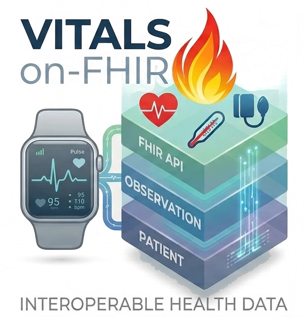

<h1 align="center">
  <picture>
    <source media="(prefers-color-scheme: dark)" srcset="src/vitals_on_fhir/dashboard/static/logo-dark.webp" />
    
  </picture>
</h1>

**Consumer wearables and home health devices → HL7® FHIR® R4.**

> **Status:** early development (spec-driven). Commands, endpoints, and class names may change until the first release.

> **Not a medical device.** A research and educational proof-of-concept for healthcare interoperability. Not for diagnosis, treatment, or any clinical decision-making.

## What is this?

Most wearables lock their data inside proprietary apps and clouds, yet many can speak open Bluetooth standards. `vitals-on-fhir` acquires vital signs from those open channels and exposes them as standards-compliant HL7 FHIR R4 Observations. Any FHIR-capable system (an EHR sandbox, a research pipeline, a caregiver dashboard) can then consume patient-generated vital signs without device-specific integrations. The project focuses on the bridge; downstream apps and analytics are left to whoever consumes the FHIR API.

The MVP acquires real-time heart rate via the standard Bluetooth Heart Rate Service (GATT `0x180D`), one device at a time.

## Quick start

**Requirements:** Python 3.12+, [uv](https://docs.astral.sh/uv/), and a Bluetooth LE adapter (only for real devices; the mock adapter needs none, and the Bluetooth library isn't even loaded).

```bash
git clone https://github.com/soroushdty/vitals-on-fhir.git
cd vitals-on-fhir
uv sync
cp .env.example .env          # optional; set VOF_API_TOKEN here to use a real device
```

**Run with simulated data (no device or token needed):**

```bash
uv run vitals-on-fhir
```

With no `VOF_API_TOKEN` set, the service starts in **demo mode**: it runs the mock adapter (`mock`, or another `mock-*` adapter you choose), the API and dashboard need no token, and a startup warning says so. A real device always needs a token: `--adapter miband10` without one stops with an error instead of falling back to simulated data. Turn demo mode off with `--no-demo` (or `VOF_DEMO_MODE=false`, or `demo_mode: false` in `config.yaml`) to make a missing token a startup error.

### Using the MVP

Once the service is running, open **`http://127.0.0.1:8000/`** in a browser. The start page shows the safety and scope notes and asks for your `VOF_API_TOKEN` (in demo mode there is no token field). Press **I understand — connect**: the token is checked, and you'll see the live heart rate, the observation timestamp, the device it came from, and the connection status update in real time. **Home** disconnects and returns to the start page, for example to use a different token. The token is not stored, so a reload asks for it again. The **Light / Dark** switch at the top right picks the colour theme (it follows your system setting until you choose, and remembers the choice in this browser), and **GitHub ↗** opens this repository.

The **FHIR resources** card, beside the readings on a wide screen, shows each reading as the FHIR Observation the server produced, with the values that changed since the previous reading highlighted. **Pause** holds the current resource while readings keep arriving, **Recent readings** lists the last 20, and selecting a `Patient/…` or `Device/…` reference opens that resource from the FHIR API.

With `--adapter mock` the dashboard also has a **Simulate a heart rhythm** panel with a dropdown of scenarios, grouped as:

- **Steady rhythms:** normal sinus rhythm, sinus bradycardia, sinus tachycardia, atrial fibrillation.
- **Rhythm episodes:** paroxysmal AF, supraventricular tachycardia (SVT), atrial flutter. Each starts normal, then the event begins and ends abruptly.
- **Activity and device:** exercise and recovery (a repeating ~2 minute ramp), an off-wrist sensor (readings are rejected and the dashboard says no valid reading has arrived), and a disconnect and reconnect (the dashboard shows the dropout and recovers on its own).

Pick a scenario and press **Simulate**: it starts from the beginning and clears everything from the previous run (the chart, the readings, and the Observations the service had stored, so `/fhir/Observation` shows only the new run). Pressing it again restarts the same scenario. These imitate the heart *rate* only (no ECG) and are not a diagnosis. The same start is available over HTTP (with your token, if one is set): `GET /mock/scenarios` lists the options and `PUT /mock/scenario` with `{"scenario": "atrial_fibrillation"}` starts one. These paths only exist for the mock adapter.

**Run with a Xiaomi Smart Band 10:**

1. Enable heart-rate broadcast on the band (a heart-rate sharing setting; its location varies by firmware).
2. Make sure the band isn't connected to another app that holds its only BLE connection. A band already connected to this computer (for example, paired in the system Bluetooth settings) is fine on Linux: the service uses that connection.
3. Set `VOF_API_TOKEN` in `.env` (real devices require it) and start the service:

```bash
uv run vitals-on-fhir --adapter miband10
```

Until the band is found, the service keeps looking and says why each attempt failed, in the terminal and on the dashboard: for example which devices it saw and whether `VOF_DEVICE_NAME` excluded them. If the band can't be found even though its broadcast is on, switch the broadcast off and on again; see [Troubleshooting](docs/device-compatibility.md#troubleshooting-the-device-is-not-found) for more.

**Run with a third-party adapter** by passing its fully qualified class path:

```bash
uv run vitals-on-fhir --adapter mypackage.adapters.MyStrapAdapter
```

## FHIR API

A local, **read-only** FHIR REST API serves the stored Observations. Every request requires `Authorization: Bearer <token>` (except in demo mode, where no token is set), responses use `application/fhir+json`, and search results are FHIR `Bundle`s (`type: searchset`).

```bash
curl -H "Authorization: Bearer $VOF_API_TOKEN" \
  "http://localhost:8000/fhir/Observation?code=http://loinc.org|8867-4&_sort=-date&_count=10"
```

See [docs/fhir-api.md](docs/fhir-api.md) for the full endpoint reference and an example Observation.

## Configuration

Configuration comes from environment variables (or `.env`), plus an optional YAML file: copy `config.yaml.example` to `config.yaml` (picked up from the working directory) or pass `--config path/to/file.yaml`. YAML keys are the variable names in lowercase without the `VOF_` prefix, and environment variables win over the file. Unknown `VOF_*` variables and unknown YAML keys are rejected at startup to catch typos. Keep `VOF_API_TOKEN` in the environment or `.env`, not in the YAML file.

| Variable | Default | Description |
|---|---|---|
| `VOF_API_TOKEN` | *(none)* | Token for the API and dashboard. Required for a real device; without it the service runs in demo mode |
| `VOF_DEMO_MODE` | `true` | With no token, run a mock adapter without authentication. `false` (or `--no-demo`) makes a missing token a startup error |
| `VOF_HOST` | `127.0.0.1` | Bind address. Localhost by default |
| `VOF_PORT` | `8000` | HTTP port |
| `VOF_ADAPTER` | `mock` | `mock`, `mock-bp`, `mock-spo2`, `mock-temp`, `mock-weight` (simulated); `miband10`, `bp`, `spo2`, `temp`, `weight`, or a fully qualified class path (`package.module.ClassName`) (real devices) |
| `VOF_DEVICE_NAME` | *(none)* | Optional BLE name filter for device discovery: any part of the advertised name, ignoring case (e.g. `Smart Band 10`) |
| `VOF_DEVICE_USER_ID` | *(none)* | Multi-user BP cuff or scale: the device user (0–254) whose readings are recorded. Other users' readings are rejected, and so is every reading from a multi-user device while this is unset (ADR-0004). Single-user devices ignore it |
| `VOF_MOCK_INTERVAL` | `1.0` | Seconds between `mock` adapter readings. The simulated rhythm is picked on the dashboard |
| `VOF_HR_MIN` / `VOF_HR_MAX` | `20` / `250` | Override the heart-rate plausibility range (bpm) |
| `VOF_SEARCH_TIMEZONE` | `UTC` | Zone of a FHIR `date` search value without a UTC offset (`date=2026-10-07` is that day in this zone): `UTC`, `local` (the host's zone), or an IANA name such as `America/Phoenix` |
| `VOF_PATIENT_ID` | `local-patient` | ID of the local Patient resource |
| `VOF_STORE_MAX` | `10000` | Maximum Observations kept in memory |

## Development

```bash
uv run pytest                  # fast suite (no hardware required)
uv run pytest -m hardware      # tests that need a real device
uv run ruff check .            # lint
uv run ruff format .           # format
uv run mypy src                # type check
```

- **CI** (GitHub Actions) runs lint, type checks, and the fast test suite on every pull request.
- **Architecture is enforced by tests**, not just documentation (for example, adapters may not import FHIR code).
- **`CHANGELOG.md`** records significant changes: implemented specs, public API changes, config changes, and steering updates.

See [docs/architecture.md](docs/architecture.md) for how the pipeline works, the extension points, and the project structure.

## Documentation

- [docs/architecture.md](docs/architecture.md) — how it works, extension points, and project structure
- [docs/fhir-api.md](docs/fhir-api.md) — read-only FHIR API reference and example Observation
- [docs/device-compatibility.md](docs/device-compatibility.md) — supported devices and standard-channel limitations
- [docs/roadmap.md](docs/roadmap.md) — planned vital signs, adapters, and integrations
- [docs/standards-and-related-work.md](docs/standards-and-related-work.md) — standards used and related projects
- [docs/](docs/) — SRS, decisions, and protocol source citations

## Security & privacy

- The API and dashboard require a bearer token. The one exception is demo mode (no token set), which serves only simulated data; a real device never runs without a token. The service binds to `127.0.0.1` by default; in demo mode on another address, anyone who can reach it can open the dashboard and change the simulated scenario.
- Observations are kept **in memory only** in the MVP and are lost on restart.
- The Bluetooth Heart Rate Service is **unauthenticated**: while broadcast is enabled, any nearby device can read the heart-rate stream. Disable broadcast when not in use.
- The MVP is not designed for exposure to untrusted networks and is not HIPAA-compliant. Don't use it with real patient data in production settings.

## Academic context

This project started as a team project for **BMI 540** in the Biomedical Informatics and Data Science program at Arizona State University. A preprint is planned.

**Team:** `Soroush Dianaty, MD`, `Nusrat Ashrafi, MS`, `Isha Uttham, BS`
**Instructor:** `Shetty Sheetal, PhD`

## Contributing

Contributions are welcome. Please open an issue before starting significant work, and add a `CHANGELOG.md` entry for any change to public APIs, configuration, or architecture. By contributing, you agree that your contributions are licensed under AGPL-3.0. Include attribution and license information for any third-party code.

## Acknowledgments

Some architectural patterns and test utilities are adapted from [EviTrace](https://github.com/soroushdty/EviTrace) (GPL-3.0) by the same author. See [`NOTICE`](NOTICE).

## License

Licensed under the [GNU Affero General Public License v3.0](LICENSE). If you modify `vitals-on-fhir` and make it available to users over a network, you must offer them the corresponding source code.

HL7® and FHIR® are registered trademarks of Health Level Seven International. This project is not affiliated with or endorsed by HL7. Device names are used only to describe compatibility and do not imply endorsement.
