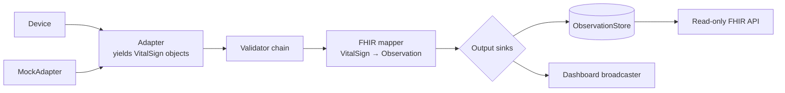

# Architecture

How `vitals-on-fhir` is put together, and how to extend it.

## Pipeline overview



1. An **adapter** connects to a device and yields immutable **vital-sign objects**, such as a `HeartRate(value=72, …)`. Adapters know nothing about FHIR.
2. A **validator chain** accepts or rejects each vital-sign object (plausible range, sensor contact, duplicates).
3. A **FHIR mapper** turns each accepted object into an R4 `Observation`, using metadata declared on the vital-sign class (LOINC code, UCUM unit, US Core profile).
4. The Observation goes to every registered **output sink**: the observation store, which serves the read-only FHIR API, and the dashboard broadcaster, which pushes it over WebSocket.

## Extension points

Every extension point is an abstract base class (ABC). The project ships concrete defaults, and you add your own by subclassing.

| Extension point | ABCs | Shipped concrete classes |
|---|---|---|
| **Vital-sign types** | `VitalSign` → `ScalarVital`, `ComponentVital` | `HeartRate` |
| **Device adapters** | `DeviceAdapter` → `BleHeartRateAdapter` | `MiBand10Adapter`, `MockAdapter` |
| **Validators** | `Validator` | `PlausibleRangeValidator`, `SensorContactValidator`, `DuplicateValidator` |
| **FHIR mappers** | `VitalMapper` | `ScalarVitalMapper`, `ComponentVitalMapper` |
| **Stores** | `ObservationStore` | `InMemoryObservationStore` |
| **Output sinks** | `ObservationSink` | `InMemoryObservationStore`, `DashboardBroadcaster` |
| **Authentication** | `Authenticator` | `StaticTokenAuthenticator` |

### Vital signs

Each class describes a *kind* of vital sign through class-level metadata. Each *instance* is one immutable measurement. The hierarchy mirrors US Core: a base vital-signs profile, with blood pressure as the one profile built from components.

```
VitalSign (ABC)
├── ScalarVital (ABC)      → HeartRate            (roadmap: OxygenSaturation, BodyTemperature, BodyWeight, RespiratoryRate)
└── ComponentVital (ABC)   → (roadmap: BloodPressure)
```

```python
@dataclass(frozen=True, kw_only=True)
class HeartRate(ScalarVital):
    loinc_code = "8867-4"
    ucum_unit = "/min"
    us_core_profile = "http://hl7.org/fhir/us/core/StructureDefinition/us-core-heart-rate"
    plausible_range = (20.0, 250.0)
    sensor_contact: bool | None = None
```

Required metadata is checked when a subclass is defined, so a vital sign without a LOINC code fails at import time. A new *scalar* vital sign needs no mapper code, because `ScalarVitalMapper` builds the Observation from the class metadata.

### Device adapters

| Class | Kind | Extend it when… |
|---|---|---|
| `DeviceAdapter` | ABC | Your device uses any channel (another BLE profile, a file export, an aggregator, …) |
| `BleHeartRateAdapter` | ABC | Your device speaks the standard Heart Rate Service. The base handles scanning, subscribing, parsing, and reconnection |
| `MiBand10Adapter` | Concrete | Shipped reference implementation |
| `MockAdapter` | Concrete | Shipped simulated-data implementation |

A compatible Heart Rate Service device typically needs only this:

```python
class MyStrapAdapter(BleHeartRateAdapter):
    def matches(self, advertisement: AdvertisementInfo) -> bool:
        return advertisement.local_name.startswith("MyStrap")

    @property
    def device_info(self) -> DeviceInfo:
        return DeviceInfo(manufacturer="Acme", model="MyStrap 2")
```

Select it without modifying this repository by passing its import path:

```bash
uv run vitals-on-fhir --adapter mypackage.adapters.MyStrapAdapter
```

## Project structure

```
vitals-on-fhir/
├── src/vitals_on_fhir/
│   ├── vitals/          # VitalSign ABCs + builtin/ (HeartRate), DeviceInfo — depends on nothing
│   ├── adapters/        # DeviceAdapter, BleHeartRateAdapter, payload parsers + builtin/ (MiBand10Adapter, MockAdapter)
│   ├── validation/      # Validator ABC, ValidationResult, validator chain + builtin validators
│   ├── fhir/            # VitalMapper ABC + mappers, Device/Patient/CapabilityStatement builders
│   ├── pipeline/        # ObservationSink ABC, orchestration (adapter → validators → mapper → sinks)
│   ├── store/           # ObservationStore ABC + InMemoryObservationStore
│   ├── api/             # Read-only FHIR REST API, Authenticator ABC + StaticTokenAuthenticator
│   ├── dashboard/       # Static dashboard + DashboardBroadcaster sink
│   ├── config.py        # Settings
│   └── cli.py           # Composition root: wires concrete classes together
├── tests/               # Mirrors src/, plus dependency-direction and contract tests
├── docs/                # SRS, architecture, decisions, protocol sources
├── CHANGELOG.md
└── .kiro/steering/      # AI-assistant steering docs
```

Each package's `__init__.py` exports its public API, grouped into ABCs and concrete defaults. Import from the package, not from internal modules.

Architecture is enforced by tests: `tests/test_dependency_directions.py` parses every module and fails if a package imports one it shouldn't (for example, adapters importing FHIR code).
