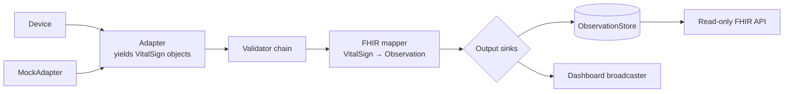

# Architecture

How `vitals-on-fhir` is put together, and how to extend it.

## Pipeline overview


```mermaid
flowchart LR
    D[Device] --> A[Adapter<br/>yields VitalSign objects]
    M[MockAdapter] --> A
    A --> V[Validator chain]
    V --> F[FHIR mapper<br/>VitalSign → Observation]
    F --> S{Output sinks}
    S --> ST[(ObservationStore)]
    S --> WS[Dashboard broadcaster]
    ST --> API[Read-only FHIR API]
```

1. An **adapter** connects to a device and yields immutable **vital-sign objects**, such as a `HeartRate(value=72, …)`. Adapters know nothing about FHIR.
2. A **validator chain** accepts or rejects each vital-sign object: plausible range (per vital, and per component for blood pressure), sensor contact, the status the device reports, which user of a shared device took the reading, and duplicates.
3. A **FHIR mapper** turns each accepted object into an R4 `Observation`, using metadata declared on the vital-sign class (LOINC codes, UCUM unit, US Core profile). A `MapperRegistry`, injected into the orchestrator, picks the mapper by the object's type.
4. The Observation goes to every registered **output sink**: the observation store, which serves the read-only FHIR API, and the dashboard broadcaster, which pushes it over WebSocket.

## Extension points

Every extension point is an abstract base class (ABC). The project ships concrete defaults, and you add your own by subclassing.

| Extension point | ABCs | Shipped concrete classes |
|---|---|---|
| **Vital-sign types** | `VitalSign` → `ScalarVital`, `ComponentVital` | `HeartRate`, `OxygenSaturation`, `BodyTemperature`, `BodyWeight`, `BloodPressure` |
| **Device adapters** | `DeviceAdapter` → `BleHeartRateAdapter` | `MiBand10Adapter`, `BloodPressureBleAdapter`, `PulseOximeterBleAdapter`, `HealthThermometerBleAdapter`, `WeightScaleBleAdapter`, and a mock for each vital sign |
| **Payload parsers** | `GattCharacteristicParser` | One per Bluetooth measurement characteristic (heart rate, blood pressure, PLX, temperature, weight) |
| **Validators** | `Validator` | `PlausibleRangeValidator`, `ComponentRangeValidator`, `SensorContactValidator`, `DeviceStatusValidator`, `DeviceUserValidator`, `DuplicateValidator` |
| **FHIR mappers** | `VitalMapper` (chosen through `MapperRegistry`) | `ScalarVitalMapper`, `ComponentVitalMapper` |
| **Stores** | `ObservationStore` | `InMemoryObservationStore` |
| **Output sinks** | `ObservationSink` | `InMemoryObservationStore`, `DashboardBroadcaster` |
| **Authentication** | `Authenticator` | `StaticTokenAuthenticator`, `AnonymousAuthenticator` (demo mode only) |

### Vital signs

Each class describes a *kind* of vital sign through class-level metadata. Each *instance* is one immutable measurement. The hierarchy mirrors US Core: a base vital-signs profile, with blood pressure as the one profile built from components.

```
VitalSign (ABC)
├── ScalarVital (ABC)      → HeartRate, OxygenSaturation, BodyTemperature, BodyWeight
└── ComponentVital (ABC)   → BloodPressure
```

A scalar vital sign declares one value:

```python
@dataclass(frozen=True, kw_only=True)
class HeartRate(ScalarVital):
    loinc_code = "8867-4"
    ucum_unit = "/min"
    us_core_profile = "http://hl7.org/fhir/us/core/StructureDefinition/us-core-heart-rate"
    plausible_range = (20.0, 250.0)
    sensor_contact: bool | None = None
```

A component vital sign declares a panel code and its components; `ComponentVitalMapper` builds the Observation's `component` list from them:

```python
@dataclass(frozen=True, kw_only=True)
class BloodPressure(ComponentVital):
    loinc_code = "85354-9"
    us_core_profile = "http://hl7.org/fhir/us/core/StructureDefinition/us-core-blood-pressure"
    components = (
        ComponentSpec(
            field_name="systolic",
            loinc_code="8480-6",
            ucum_unit="mm[Hg]",
            default_range=(50.0, 250.0),
        ),
        ComponentSpec(
            field_name="diastolic",
            loinc_code="8462-4",
            ucum_unit="mm[Hg]",
            default_range=(30.0, 150.0),
        ),
    )
    systolic: float
    diastolic: float
```

Required metadata is checked when a subclass is defined, so a vital sign without a LOINC code fails at import time. A new vital sign needs no mapper code: a `ScalarVital` subclass is mapped by `ScalarVitalMapper` and a `ComponentVital` subclass by `ComponentVitalMapper`, both from the class metadata. A profile that requires more than one code (US Core Pulse Oximetry needs `59408-5` and `2708-6`) lists the extra ones in `additional_loinc_codes`.

### Device adapters

| Class | Kind | Extend it when… |
|---|---|---|
| `DeviceAdapter` | ABC | Your device uses any channel (another BLE profile, a file export, an aggregator, …) |
| `BleHeartRateAdapter` | ABC | Your device speaks the standard Heart Rate Service. The base handles scanning, subscribing, parsing, and reconnection |
| `BleConnection` | Helper (composition) | Your adapter speaks another standard BLE service: hold a `BleConnection` for the service and characteristic UUIDs and a parser, and it handles scanning, subscribing and reconnection |
| `MiBand10Adapter` | Concrete | Shipped reference implementation, tested on hardware |
| `BloodPressureBleAdapter`, `PulseOximeterBleAdapter`, `HealthThermometerBleAdapter`, `WeightScaleBleAdapter` | Concrete | Shipped; any device with the standard service. Not yet tried with a specific device |
| `MockAdapter`, `MockBloodPressureAdapter`, `MockOximeterAdapter`, `MockThermometerAdapter`, `MockWeightAdapter` | Concrete | Shipped simulated data, labelled as test data (`HTEST`) |

A compatible Heart Rate Service device typically needs only this:

```python
class MyStrapAdapter(BleHeartRateAdapter):
    def matches(self, advertisement: AdvertisementInfo) -> bool:
        return advertisement.local_name.startswith("MyStrap")

    @property
    def device_info(self) -> DeviceInfo:
        return DeviceInfo(manufacturer="Acme", model="MyStrap 2")
```

Select it without modifying this repository by passing its import path:

```bash
uv run vitals-on-fhir --adapter mypackage.adapters.MyStrapAdapter
```

## Project structure

```
vitals-on-fhir/
├── src/vitals_on_fhir/
│   ├── vitals/          # VitalSign ABCs + builtin/ (five vital signs), DeviceInfo — depends on nothing
│   ├── adapters/        # DeviceAdapter, BleHeartRateAdapter, BleConnection, payload parsers + builtin/ (BLE and mock adapters)
│   ├── validation/      # Validator ABC, ValidationResult, validator chain + builtin validators
│   ├── fhir/            # VitalMapper ABC, MapperRegistry + mappers, Device/Patient/CapabilityStatement builders
│   ├── pipeline/        # ObservationSink ABC, orchestration (adapter → validators → mapper → sinks)
│   ├── store/           # ObservationStore ABC + InMemoryObservationStore
│   ├── api/             # Read-only FHIR REST API, Authenticator ABC + StaticTokenAuthenticator, AnonymousAuthenticator
│   ├── dashboard/       # Static dashboard + DashboardBroadcaster sink
│   ├── config.py        # Settings
│   └── cli.py           # Composition root: wires concrete classes together
├── tests/               # Mirrors src/, plus dependency-direction and contract tests
├── docs/                # Guides, decision records, briefs, protocol sources
├── CHANGELOG.md
└── .kiro/               # steering/: requirements and conventions; specs/: each feature's design and tasks
```

Each package's `__init__.py` exports its public API, grouped into ABCs and concrete defaults. Import from the package, not from internal modules.

Architecture is enforced by tests: `tests/test_dependency_directions.py` parses every module and fails if a package imports one it shouldn't (for example, adapters importing FHIR code).
